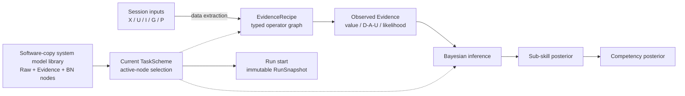

# Pilot Assessment System

面向飞行训练领域专家的 Windows 本地评估模型设计与运行系统：把多模态仿真 session 转换为可观测 Evidence，再用专家可编辑的 Bayesian Network 推断飞行员的 sub-skill 与 competency 后验分布。

本项目对应课题 **Development of AI-Based System for Evaluating eVTOL Pilot Training Effectiveness**。它首先是一套让专家设计评估方法的平台，不是一套已经证明科学有效的固定评分标准。

## 系统设计逻辑



运行时计算顺序是：

```text
session 数据 -> Evidence 提取 -> Evidence observation -> BN posterior inference -> 能力结果
```

BN 本身的概率图不能与这个程序执行顺序混为一谈。Starter 模型使用标准生成式方向：

```text
Competency --probability--> Sub-skill --probability--> Evidence
```

它表示 `P(child | parents)` 的概率分解。实际评估观察 Evidence 后，再计算 `P(Sub-skill, Competency | Evidence)`。前端可以用只读 overlay 显示 `Evidence ⇢ Sub-skill ⇢ Competency` 的后验信息影响，但不会为了显示而反转存储的 BN 箭头。

## 三类节点、两类边

| 元素 | 含义 |
|---|---|
| Raw Input node | X(t) 飞行状态、U(t) 操纵输入、I(t) VR 第一视角、G(t) gaze/AOI、P(t) EEG/ECG 等数据源；不属于 BN，也没有 CPT |
| Evidence node | 用 `EvidenceRecipe` 从 session 提取的可观测变量，并通过 observation binding 进入 BN |
| BN node | sub-skill、aggregate competency 或专家定义的其他随机变量 |
| Data / extraction edge | `Raw Input -> Evidence`；只表达数据和计算依赖 |
| Probabilistic BN edge | `BN parent -> child`；表达 child CPD/CPT 的条件依赖 |

Evidence 节点的独立浮动窗口必须同时让专家看到两件事：

1. 它如何从原始数据提取，包括输入、窗口、算子、公式、参数、聚合和 scorer；
2. 它如何在 BN 中被解释，包括 observation states、probabilistic parents 和 CPT/likelihood。

这两组关系使用不同的数据合同、编辑操作、图形样式和校验器。

高层 extraction graph 不使用 `Evidence -> Evidence` 或 `BN Node -> EvidenceRecipe` 作为数据边。复用计算通过 Evidence 内部的通用 operator/subgraph 或可追溯到 raw/task source 的 typed derived artifact 完成；Evidence 之间若存在概率关系，则必须作为带 CPD/CPT 的 probabilistic BN edge 明确建模。

## 系统级完整节点库、项目与任务方案

每套解压的软件副本在自身 `system/` 目录中维护唯一的系统级节点库。画布上的每个 Evidence/BN 圆形节点都是一个完整、独立、只有一个当前功能定义的 `ModelNode`：名称、fixed parents、EvidenceRecipe/parameters/scorer 或 BN states/CPT 都属于该节点。同一软件副本打开的所有项目立即共享这些节点和任务方案；项目自身只保存 Session、不可变 RunSnapshot、运行、结果和 artifacts。

如果不同任务需要不同算法、parents 或 CPT，就使用不同节点，而不是在同一个节点中切换版本。例如：

- `Precise`：starter 节点；
- `hover.Precise`：从 starter 复制并为 Hover 修改的新节点；
- `straight.Precise`：为直线保持建立的另一个节点。

每个 `TaskScheme` 只是全局节点上的激活配置：

- 左侧任务列表直接切换 Base、Hover、Straight 等并列方案；
- 当前方案采用的节点和边明亮，未采用但真实存在的全局节点和边变暗；
- 启用 child 自动递归启用全部 fixed parents；
- 停用仍有 active downstream 的 parent 时，先列出影响并让专家继续或取消；
- 多个任务可以共享完全相同的节点；某任务需要修改时，专家复制节点、重命名、修改并在该任务停用旧节点。

默认 copy/paste 只深复制选中节点自身，并继续引用原 fixed parents，不复制整条 parent branch。复制任务方案会立即在左侧新增一个可切换、可编辑的并列方案，默认继续共享全局节点。

正常 UI 没有业务 Draft/Published/Apply/Publish。一次应用会话中的 current nodes、TaskSchemes、边、CPT 和布局修改会先持久暂存到 `system/staging/model-edit/`；关闭主程序时统一选择“保存全部并关闭／放弃全部并关闭／取消”。切换或关闭项目不会切换或丢弃这套系统模型编辑会话。只有 clean canonical workspace 可以运行。每次 `run.start` 会把 exact managed session、active closure、完整节点定义、recipes/operators、CPT 与 hashes 冻结到目标项目的 immutable `RunSnapshot`；后续系统模型编辑只影响未来运行，历史结果不会变化。旧 M5/M6 immutable versions 与 published schemes 继续作为迁移和历史 replay 资产，不是新的专家交互模型。

## 专家最终可以修改什么

在完整 Windows 产品中，专家应能直接在可视化工作区中：

- 新增、复制、停用、恢复或移除 Evidence；
- 修改 Evidence 输入、窗口、通用算子、参数、公式、聚合和 D/A/U/soft scorer；
- 展开 Evidence 内部 operator graph；
- 新增、删除和连接 BN nodes；
- 修改 state space、probabilistic parents 和 CPT；
- 在左侧复制、切换和编辑多个任务方案，并以亮暗查看 active closure；
- 同时打开多个可移动、缩放、最大化的节点浮动窗口进行比较；
- 修改一个共享节点，或先复制为任务专用新节点再修改；
- preview 当前节点/方案，并从历史 RunSnapshot 重放结果；
- 在中文与英文之间即时切换界面和模型名称。

普通修改继续由专家在前端完成并提交给 Python backend 保存，不需要发布 Python plugin、人工审批或逐次运行开发测试。只有现有 operator/core 无法达到新的计算目标时，具备 Python 能力的专家才直接修改发布目录中完整暴露的 backend 源码。每个解压系统只有一棵活动 Python source tree；关闭并重启软件后，修改对该系统副本打开的全部项目和未来运行生效。系统不需要内置源码编辑器，正式文档会逐模块说明如何修改、新增 operator、注册、增加依赖、恢复和验证。

## 数据接口

正式 session contract 为多模态设计：

| 概念接口 | 典型内容 |
|---|---|
| X(t) | 位置、姿态、速度、加速度和其他飞行状态 |
| U(t) | 操纵杆、踏板、推力和控制器输入 |
| I(t) | 随飞行员头部转动变化的 VR 第一视角画面 |
| G(t) | gaze ray/point、stare、fixation、AOI 与置信度 |
| P(t) | EEG、ECG 及未来声明的其他生理模态 |
| pilot_camera(t) | 可选的驾驶员脸部/身体画面；不等同于 I(t) |

任务 reference、phase/event annotations、AOI 和期望轨迹由 TaskScheme 绑定的 typed task resources 提供。当前 repository-external CSV 只用于理解采集格式和验证接口；它不是标准飞行轨迹、任务 ground truth 或能力证据。

Session Import 现在同时接受两种目录：已经包含 `manifest.json` 的 canonical Session Bundle，以及模拟器直接导出的 `streams/` + `annotations/`。后一种由 Python 后端只读检查，并在项目受管 staging 中自动生成 manifest、checksum 和 canonical annotations；模拟器原目录不被修改。缺失模态保持 `missing`，绝不自动合成。字段没有声明单位时保持未声明，不要求用户填写、不猜测、不换算，原始数值继续按匹配到的固定 adapter/Evidence 方法计算。

## 差表现与缺失数据

系统不研究“飞得差是不是数据质量差”。进入 Evidence 层的数据假定已满足上游文件、schema、字段和时间合同：

- 轨迹偏差大、控制剧烈、生理数值极端、未响应、未恢复或未注视，应按专家规则形成负面 Evidence，通常是 `computed + Unacceptable`；
- `computed + Unacceptable` 是有效 observation，不是 missing，也不会被过滤；
- 只有输入确实缺失、任务不适用、配置/依赖不足或软件错误，才使用对应的非 computed 状态；
- coverage 表示所需 Evidence 是否形成并被采用，不表示表现好坏。

## 当前实现状态

截至 2026-07-21：

| 里程碑 | 状态 |
|---|---|
| M1 Backend Foundation | 已工程验证 |
| M2 Multimodal Synthetic Foundation | 已工程验证 |
| M3 Native-Rate Time Synchronization | 已工程验证 |
| M4R Editable Evidence Computation Foundation | 已工程验证；canonical `EvidenceRecipe`、typed operators、compiler/executor、draft/preview/apply/replay 与 18 个 starter recipes 已实现 |
| M5 Shared Model Library and Bayesian Workspace | 已工程验证；global immutable component library、exact-pinned scheme、draft/undo/redo、copy-on-write atomic publish、通用 CPT、finite-discrete exact inference、M4R migration、Hover starter package 与 lightweight preview/publish/replay workflow 已完成 |
| M6 Local Runtime / Persistence / Protocol | 已工程验证；受管 project/session/artifact、SQLite 持久化、exact run、Evidence→BN pipeline、progress/cancel/recovery 与 stdio JSON-RPC sidecar 已实现 |
| M7 WinUI Expert Designer | 原工程门与 D-054、D-056–D-061 返修均已工程实现；现有 WinUI 支持后端持久草稿、关闭时统一保存/放弃/取消、全局 undo/redo、五层画布、语义名称/eVTOL 品牌，以及 canonical/raw session 统一导入。**用户手工验收尚未完成，D-055 单字段 canonical contract 迁移仍待实施** |
| M8A Portable Windows Release | 已工程实现；自包含 WinUI、私有 Python、唯一公开 backend source、manifest/checksum/SBOM 与仓库外启动验证已完成 |
| M8B-0 System-Owned Model Library | 已工程实现；每套软件副本一个 `system/model-library.sqlite3`、无 project Model Studio、双项目共享、project/run 分离、legacy import、single-writer 与含 starter system baseline 的新 ZIP 已验证 |
| M8B-1 Source Provenance and Snapshot | 已工程实现；loaded source/runtime/dependency/operator identity、disk drift/restart boundary、RunSnapshot v0.2 与内容寻址 source snapshot 已验证 |
| M8B-2 Python Operator Extension Handoff | 正在实施；发布副本新增 operator、私有依赖工具、通用参数表单与维护手册的完整闭环尚未关闭 |
| M8C–M8E | 待实施；分类 Markdown/DOCX 手册、备份恢复迁移、最终用户验收与 clean release candidate 尚未完成 |

原 M7 completion gate 的 fresh 证据为 desktop Unit `84/84`、real-sidecar Contract `4/4`、x64 Debug build `0 warning / 0 error`，并实际恢复一个包含 `18` Evidence、`4` posterior variables、`39` artifact references 的只读结果。D-056/D-057 返修的 fresh gate 为 Python focused `6/6`、desktop Unit `90/90`、real-sidecar Contract `4/4`、x64 Debug build `0 warning / 0 error`，并成功启动真实 WinUI。D-058/D-059 显示与品牌返修初始 gate 为 desktop Unit `95/95`；2026-07-19 又补齐 EXE 的 `ApplicationIcon` 嵌入和快捷方式刷新，当前 fresh gate 为 desktop Unit `96/96`、real-sidecar Contract `4/4`、x64 Debug build `0 warning / 0 error`，并从 EXE/快捷方式直接提取出同一 eVTOL 图标后再次启动真实 WinUI。M8B-0 最终提交轮次的 fresh gate 为 Python focused `22/22`、desktop Unit `102/102`、real-sidecar Contract `4/4`、x64 Debug build `0 warning / 0 error`，并完成仓库外 ZIP、双项目与 live-source smoke。M8B-1 fresh gate 为 Python focused `56/56` 加独立 restart slice `1/1`、desktop Unit `102/102`、real-sidecar Contract `4/4`、x64 Debug build `0 warning / 0 error`，并验证发布副本 source baseline、修改后重启和 source artifact。上述数字只证明工程工作流，不能替代用户亲自验收。当前 18 个 Evidence、11 个 sub-skills、4 个 competencies 和 Hover BN 都只是 `starter_template` / `engineering_default`。通用代码、schema、API、UI 和测试不得依赖这些数量、名称或连接。完整产品仍因 M7 user acceptance pending、D-055 与 M8B-2–M8E 未完成而为 `in_progress`，`formal_run_authorized=false`。

## 从这里开始阅读

1. [M8B System-Owned Model Library Design](docs/product/specs/2026-07-21-m8b-system-owned-model-library-and-editable-backend-provenance-design.md)、[M8B-1 Plan](docs/product/plans/2026-07-21-m8b1-source-provenance-and-snapshot-implementation-plan.md) 与 [Verification](docs/product/reviews/2026-07-21-m8b1-source-provenance-and-snapshot-verification.md) — 当前 system/project/run ownership、loaded backend identity 与历史 source snapshot 权威。
2. [M7 Human-readable UI and eVTOL Branding Amendment](docs/product/specs/2026-07-18-m7-human-readable-ui-and-evtol-branding-amendment.md) — 当前语义名称、技术身份展示层级和桌面品牌资产修订。
3. [M7 Simulator Raw Session Import Adapter Amendment](docs/product/specs/2026-07-20-m7-simulator-raw-session-import-adapter-design.md) 与 [Implementation Plan](docs/product/plans/2026-07-20-m7-simulator-raw-session-import-adapter-implementation-plan.md) — 当前 canonical/raw 统一导入、受管 materialization 与未声明单位透传规则。
4. [M7 Staged Edit Session and Five-Layer Canvas Amendment](docs/product/specs/2026-07-18-m7-staged-edit-session-and-five-layer-canvas-amendment.md) — 当前保存边界、全局 undo/redo、五层画布和 dirty-run 权威修订。
5. [M7 WinUI Expert Designer and Task Activation Workspace Design](docs/product/specs/2026-07-17-m7-winui-expert-designer-and-task-activation-workspace-design.md) — 完整节点、任务激活、多浮窗与 RunSnapshot 基础设计；ownership 冲突处由 M8B 取代。
6. [M7 Human-readable UI Plan](docs/product/plans/2026-07-18-m7-human-readable-ui-and-evtol-branding-implementation-plan.md)、[M7 Staged Edit Session Plan](docs/product/plans/2026-07-18-m7-staged-edit-session-and-five-layer-canvas-implementation-plan.md) 与 [M7 Implementation Roadmap](docs/product/plans/2026-07-17-m7-winui-expert-designer-implementation-roadmap.md) — 当前返修实现与历史 M7A/M7B 执行顺序。
7. [M8 Pre-UAT Design Outline](docs/product/specs/2026-07-18-m8-productization-editable-python-documentation-and-handoff-outline.md) 与 [M8 Pre-UAT Implementation Outline](docs/product/plans/2026-07-18-m8-pre-uat-implementation-outline.md) — M8A、M8B-0 与 M8B-1 已执行，M8B-2–M8E 继续按真实状态分阶段实施。
8. [产品设计文档中心](docs/product/README.md) — 全部正式文档、阅读顺序与权威规则。
9. [Implementation Status](docs/product/11_IMPLEMENTATION_STATUS.md) — 真实代码状态、迁移缺口、验证证据和下一步。
10. [M5 Shared Versioned Model Library and Bayesian Workspace Design](docs/product/specs/2026-07-16-m5-shared-versioned-model-library-and-bayesian-workspace-design.md) — 已实现后端基础与历史 identity/publish 语义。
11. [M6 Local Runtime, Durable Persistence and Sidecar Protocol Design](docs/product/specs/2026-07-16-m6-local-runtime-persistence-and-protocol-design.md) — 已实现的持久化、运行生命周期与本地协议规格。
12. [产品总览](docs/product/01_PRODUCT_OVERVIEW.md) — 用户、工作流和总体架构；ownership 冲突处以 M8B 为准。
13. [Expert-Editable Evidence and Assessment Model Design](docs/product/specs/2026-07-15-expert-editable-evidence-and-model-design.md) — M4R–M8 expert-designer 重基线。
14. [Decisions](docs/product/DECISIONS.md) 与 [Glossary](docs/product/GLOSSARY.md) — 已锁定口径和术语。

## 目录

```text
src/pilot_assessment/     # Python Core
tests/                    # 轻量平台不变量、合同与工作流测试
schemas/                  # 确定性生成的跨语言 JSON Schema
docs/product/             # 当前产品基线、里程碑规格、计划与复核记录
```

`docs/product/specs/` 保存状态受控设计，`docs/product/plans/` 保存已批准规格的实施步骤；计划不能覆盖正式规格或 `DECISIONS.md`。

开发环境可用 `python -m pilot_assessment.sidecar` 启动本地 stdio 后端；它会使用仓库忽略目录 `.pilot-assessment-local/system/`。正常桌面使用只需启动 EXE，前端会自动启动该后端和 SQLite system store，不需要手工激活 Python 或数据库。它不监听网络端口；第一个请求必须是 `runtime.hello`。

## 开发验证

安装 [uv](https://docs.astral.sh/uv/) 后，在本目录运行：

```powershell
uv sync --all-groups
uv run python -m pilot_assessment.schemas.export
uv run pytest -q
uv run ruff check .
uv run ruff format --check .
uv run ty check src
uv build
```

这些命令验证软件合同和执行路径，不证明任何 Evidence、阈值、CPT 或能力结论科学有效。详细验证数字见 [Implementation Status](docs/product/11_IMPLEMENTATION_STATUS.md)。

## 产品边界

- Windows 原生前端：WinUI 3；
- 本地后端：Python Assessment Core；
- 进程桥接：JSON-RPC 2.0 / JSONL over stdin/stdout；
- 大型数据通过 session 路径、manifest 和 checksum 读取，不进入 JSON 消息；raw simulator source 先在受管 staging 中物化为 canonical Bundle；
- 前端提交 domain operations，后端先持久保存 edit-session state；用户选择“保存全部”后再原子更新 canonical state；
- 软件验证与科学验证始终分别记录；
- v0 不用于执照、医疗、适航认证或实时机载决策。
