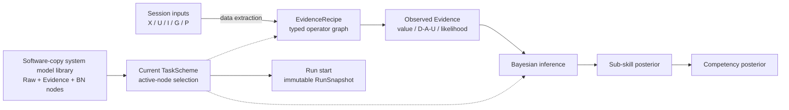

# Pilot Assessment System

面向飞行训练领域专家的 Windows 本地评估模型设计与运行系统：把多模态仿真 session 转换为可观测 Evidence，再用专家可编辑的 Bayesian Network 推断飞行员的 sub-skill 与 competency 后验分布。

本项目对应课题 **Development of AI-Based System for Evaluating eVTOL Pilot Training Effectiveness**。它首先是一套让专家设计评估方法的平台，不是一套已经证明科学有效的固定评分标准。

## 这款软件用来做什么

传统评估程序常把“读取数据、计算指标、能力评分”写成一套固定代码。只要飞行任务、Evidence 定义或能力结构改变，就要重新改程序。本系统把这些内容拆成可编辑的系统模型，让领域专家能够在同一套 Windows 软件中完成以下工作：

- 导入一次仿真飞行产生的多模态 Session，并保留原始数据和时间关系；
- 定义怎样从轨迹、操纵、VR 画面、眼动、EEG、ECG 等输入中提取 Evidence；
- 直接编辑静态 Bayesian Network 的节点、父子关系、状态空间与 CPT；
- 为 Hover、直线保持以及未来其他飞行任务建立互不覆盖、可随时切换的评估方案；
- 选择每种任务真正关注的 Evidence、sub-skills 和 competencies，使评估重点随任务改变；
- 执行评估并追溯每项结果使用的数据、EvidenceRecipe、operator、参数、BN/CPT 和源码身份。

因此，本产品的核心不是“给出一套永远不变的飞行员分数”，而是提供一套可视化、可追溯、可扩展的**评估系统设计器与执行环境**。当前 Hover、18 个 Evidence、11 个 sub-skills、4 个 competencies、阈值和 CPT 只是可运行的初始模板，后续应由领域专家持续修改和扩充。

## 总体架构与计算逻辑



运行时计算顺序是：

```text
session 数据 -> Evidence 提取 -> Evidence observation -> BN posterior inference -> 能力结果
```

BN 本身的概率图不能与这个程序执行顺序混为一谈。Starter 模型使用标准生成式方向：

```text
Competency --probability--> Sub-skill --probability--> Evidence
```

它表示 `P(child | parents)` 的概率分解。实际评估观察 Evidence 后，再计算 `P(Sub-skill, Competency | Evidence)`。前端可以用只读 overlay 显示 `Evidence ⇢ Sub-skill ⇢ Competency` 的后验信息影响，但不会为了显示而反转存储的 BN 箭头。

## 从打开软件到得到评估结果

一次完整使用流程如下：

1. **启动软件**：用户运行产品根目录唯一入口 `PilotAssessment.exe`；它打开收纳于 `app/` 的 WinUI/.NET 桌面载荷，前端再自动启动随包携带的 Python sidecar，并打开该软件副本的 SQLite system model store，不需要手工启动数据库或激活 Python。
2. **创建或打开项目**：Project 是一次研究或评估工作的容器，保存 Session、运行记录、不可变 RunSnapshot、结果和 artifacts；它不拥有全局 Evidence/BN 定义。
3. **导入 Session**：选择 canonical Session Bundle，或模拟器直接导出的 `streams/` + `annotations/` 目录。后端只读检查来源，并复制/物化到项目受管存储。
4. **选择任务方案**：从左侧选择 Base、Hover、Straight 等 `TaskScheme`，或复制现有方案建立新任务。画布以亮/暗显示当前任务启用和未启用的节点与边。
5. **设计或调整评估模型**：在画布中创建、复制、连接、停用或全局删除 Evidence/BN 节点；按住节点并拖动可调整布局，点击节点后在独立浮动窗口修改 recipe、operator 参数、parents、states 和 CPT。
6. **保存系统模型**：修改先进入 `system/staging/model-edit/`；关闭软件时选择“保存全部并关闭”才原子写入当前 canonical system model，也可以放弃全部更改或取消关闭。
7. **技术预检并运行**：后端检查 active closure、输入依赖、EvidenceRecipe 和 BN/CPT 的技术可执行性，然后从当前 Session 与方案自动冻结 immutable `RunSnapshot`。选择“评估”用途不会因为 `formal_run_authorized=false` 被技术阻止；系统以 warning 和 engineering-only provenance 保留科学边界。
8. **查看结果与追溯**：界面显示 Evidence 的 D/A/U 或 likelihood、sub-skill/competency posterior、缺失 Evidence、inference influence、trace 和 artifacts。以后修改模型不会改变历史 RunSnapshot 和结果。

RC.3 的便携发布根目录专门保持为可读的产品结构：

```text
PilotAssessment.exe   # 唯一启动器
README.txt
app/                   # WinUI/.NET/Windows App SDK 载荷
backend/               # 活动、可编辑 Python 源码
system/                # 全局 Evidence/BN/任务方案模型库
runtime/               # 私有 Python 与依赖
developer/             # C# 源码、release tools、operator 示例
docs/                   # 双语手册与交付说明
licenses/               # 第三方许可
manifest/               # checksums、SBOM、source/system baseline
```

用户 project 不在这棵目录里；它们由用户自行选择位置，只保存 Session、RunSnapshot、运行结果和 artifacts。框架 DLL、WinMD 和语言资源全部位于 `app/`，不会再淹没产品根入口。

Session 不要求五类输入全部存在。依赖缺失模态的 Evidence 会得到明确的 `missing_input` 等状态，不会伪造数据；仍可计算的 Evidence 继续进入 BN，未观测变量由推理引擎边缘化。因此，同一套系统既可以处理完整多模态 Session，也可以利用当前已有数据完成部分证据下的评估。

## 三类节点、两类边

| 元素 | 含义 |
|---|---|
| Raw Input node | X(t) 飞行状态、U(t) 操纵输入、I(t) VR 第一视角、G(t) gaze/AOI、P(t) EEG/ECG 等数据源；不属于 BN，也没有 CPT |
| Evidence node | 用 `EvidenceRecipe` 从 session 提取的可观测变量，并通过 observation binding 进入 BN |
| BN node | sub-skill、aggregate competency 或专家定义的其他随机变量 |
| Data / extraction edge | `Raw Input -> Evidence`；只表达数据和计算依赖 |
| Probabilistic BN edge | `BN parent -> child`；表达 child CPD/CPT 的条件依赖 |

为了让专家更容易理解，主画布把这些领域对象投影为五个从左到右的视觉层级：`Raw Input Family -> Extracted Data -> Evidence -> Sub-skill -> Competency`。其中 Sub-skill 和 Competency 都是 BN node；Extracted Data 是 Evidence 内部数据来源/处理中间层的可视化，不会被误当成新的概率节点类型。

Evidence 节点的独立浮动窗口必须同时让专家看到两件事：

1. 它如何从原始数据提取，包括输入、窗口、算子、公式、参数、聚合和 scorer；
2. 它如何在 BN 中被解释，包括 observation states、probabilistic parents 和 CPT/likelihood。

这两组关系使用不同的数据合同、编辑操作、图形样式和校验器。

高层 extraction graph 不使用 `Evidence -> Evidence` 或 `BN Node -> EvidenceRecipe` 作为数据边。复用计算通过 Evidence 内部的通用 operator/subgraph 或可追溯到 raw/task source 的 typed derived artifact 完成；Evidence 之间若存在概率关系，则必须作为带 CPD/CPT 的 probabilistic BN edge 明确建模。

## 系统级完整节点库、项目与按任务扩展方案

每套解压的软件副本在自身 `system/` 目录中维护唯一的系统级节点库。画布上的每个 Evidence/BN 圆形节点都是一个完整、独立、只有一个当前功能定义的 `ModelNode`：名称、fixed parents、EvidenceRecipe/parameters/scorer 或 BN states/CPT 都属于该节点。同一软件副本打开的所有项目立即共享这些节点和任务方案；项目自身只保存 Session、不可变 RunSnapshot、运行、结果和 artifacts。

如果不同任务需要不同算法、parents 或 CPT，就使用不同节点，而不是在同一个节点中切换版本。例如：

- `Precise`：starter 节点；
- `hover.Precise`：从 starter 复制并为 Hover 修改的新节点；
- `straight.Precise`：为直线保持建立的另一个节点。

### 不同飞行任务怎样形成不同评估系统

每个 Evidence/BN 节点都是全局模型库中的独立完整定义；每个任务方案选择其中一部分节点组成该任务实际使用的静态网络。这里的“静态”是指：节点的 parents、states、CPT 和 EvidenceRecipe 在一次运行开始前已经确定，运行期间只进行 Evidence 计算和 Bayesian inference，不会临时学习或改写网络结构。

以 Hover 和直线保持为例：

| 设计内容 | Hover 方案 | Straight 方案 |
|---|---|---|
| Evidence 提取 | 可采用悬停位置偏差、持续稳定时间、扰动恢复和 AOI 关注 | 可采用横向/高度偏差、航向稳定、直线保持和相关监控 Evidence |
| 同类但不同算法 | 启用 `hover.Precise`，使用 Hover reference、窗口和阈值 | 启用 `straight.Precise`，使用直线 reference、窗口和阈值 |
| BN 结构 | 激活与悬停控制、监控和沉着相关的节点与固定关系 | 激活直线保持任务关注的节点；可共享通用节点，也可使用复制后的任务专用节点 |
| 评估侧重 | 由 active Evidence、sub-skills、competencies 和 outputs 决定 | 由另一套 active selection 决定，不覆盖 Hover 方案 |

专家建立新任务时可以按以下方式工作：

1. 复制最接近的 `TaskScheme`，在左侧得到一个新的并列方案；
2. 复用所有定义完全相同的通用节点；
3. 对需要改变提取逻辑、parents、states 或 CPT 的节点执行 copy/paste，重命名为新的任务专用节点；
4. 修改新 Evidence 的输入、窗口、operator/参数和 scorer，或修改新 BN 节点的 fixed parents、states 与 CPT；
5. 在新任务中启用定制节点并停用旧节点，系统自动补齐 parent closure；
6. 保存后，该任务拥有自己确定的 active static BN，原任务方案及其节点不会被覆盖。

如果一个节点同时适用于多个任务，可以直接由多个 `TaskScheme` 共享。只有当其父节点、EvidenceRecipe、状态或 CPT 需要变化时，才应复制成另一个独立节点。这样既避免重复，又不会为了切换任务反复改回同一个节点。

每个 `TaskScheme` 只是全局节点上的激活配置：

- 左侧任务列表直接切换 Base、Hover、Straight 等并列方案；
- 当前方案采用的节点和边明亮，未采用但真实存在的全局节点和边变暗；
- 启用 child 自动递归启用全部 fixed parents；
- 停用仍有 active downstream 的 parent 时，先列出影响并让专家继续或取消；
- 多个任务可以共享完全相同的节点；某任务需要修改时，专家复制节点、重命名、修改并在该任务停用旧节点。

默认 copy/paste 只深复制选中节点自身，并继续引用原 fixed parents，不复制整条 parent branch。复制任务方案会立即在左侧新增一个可切换、可编辑的并列方案，默认继续共享全局节点。

正常 UI 没有业务 Draft/Published/Apply/Publish。一次应用会话中的 current nodes、TaskSchemes、边、CPT 和布局修改会先持久暂存到 `system/staging/model-edit/`；关闭主程序时统一选择“保存全部并关闭／放弃全部并关闭／取消”。切换或关闭项目不会切换或丢弃这套系统模型编辑会话。只有 clean canonical workspace 可以运行。每次 `run.start` 会把 exact managed session、active closure、完整节点定义、recipes/operators、CPT 与 hashes 冻结到目标项目的 immutable `RunSnapshot`；后续系统模型编辑只影响未来运行，历史结果不会变化。旧 M5/M6 immutable versions 与 published schemes 继续作为迁移和历史 replay 资产，不是新的专家交互模型。

## 专家最终可以修改什么

### 日常模型扩展：只使用前端

在完整 Windows 产品中，专家应能直接在可视化工作区中：

- 新增、复制、停用、恢复或移除 Evidence；
- 修改 Evidence 输入、窗口、通用算子、参数、公式、聚合和 D/A/U/soft scorer；
- 展开 Evidence 内部 operator graph；
- 新增、删除和连接 BN nodes；
- 修改 state space、probabilistic parents 和 CPT；
- 在左侧复制、切换和编辑多个任务方案，并以亮暗查看 active closure；
- 同时打开多个可移动、缩放、最大化的节点浮动窗口进行比较；
- 修改一个共享节点，或先复制为任务专用新节点再修改；
- preview 当前节点/方案，并从历史 RunSnapshot 重放结果；
- 在中文与英文之间即时切换界面；模型中的 canonical 名称和内容统一保持英文。

这些操作直接修改 `system/` 中的全局模型库，而不是临时覆盖某个 Project。Python 后端提供通用 EvidenceRecipe 执行器和 BN inference engine，因此新增节点、修改父子关系或 CPT 不要求为每个节点手写新的后端类；保存后的图、参数和 CPT 就是后端下一次运行读取的正式模型。

### 新计算机制：修改随包公开的 Python 源码

普通参数、公式组合、窗口、节点、边、states、CPT 和任务激活都应由专家在前端完成，不需要发布 Python plugin、人工审批或逐次运行开发测试。只有现有 operators 无法表达新的 Evidence 提取目标时，才需要扩展底层计算机制，例如加入一种新的图像特征、信号处理或事件识别算法。

发布包完整暴露唯一活动的 `backend/src/pilot_assessment/` 源码树，并提供普通 Python 扩展入口。具备 Python 能力的专家可以：

1. 在 Evidence operator 扩展目录中实现新的 typed operator；
2. 声明输入/输出端口和可由前端自动生成表单的 parameter JSON Schema；
3. 在扩展注册入口登记 operator，必要时使用随包工具增加私有 Python 依赖；
4. 关闭并重启软件，使 sidecar 加载新源码和新 operator；
5. 回到前端，把新 operator 组合进一个或多个 EvidenceRecipe，再由不同 TaskScheme 选择相应 Evidence 节点。

每个解压系统只有这一棵活动 Python source tree；源码修改对该软件副本打开的全部项目和未来运行生效，历史 RunSnapshot 仍保存原 source identity。系统不要求内置源码编辑器，交付文档会逐模块说明源码位置、operator 注册、依赖管理、重启边界、恢复和轻量验证方法。

对应的详细操作手册：

- [Evidence 与任务方案专家手册](docs/product/manuals/zh-CN/04-evidence-task-scheme-expert-guide.md)
- [BN、父节点、状态与 CPT 专家手册](docs/product/manuals/zh-CN/05-bayesian-network-cpt-expert-guide.md)
- [Python operator 源码扩展手册](docs/product/manuals/zh-CN/07-python-operator-source-extension.md)
- [Python Core 维护参考](docs/product/manuals/zh-CN/08-python-core-maintenance-reference.md)

## 数据接口

正式 session contract 为多模态设计：

| 概念接口 | 典型内容 |
|---|---|
| X(t) | 位置、姿态、速度、加速度和其他飞行状态 |
| U(t) | 操纵杆、踏板、推力和控制器输入 |
| I(t) | 随飞行员头部转动变化的 VR 第一视角画面 |
| G(t) | gaze ray/point、stare、fixation、AOI 与置信度 |
| P(t) | EEG、ECG 及未来声明的其他生理模态 |
| pilot_camera(t) | 可选的驾驶员脸部/身体画面；不等同于 I(t) |

任务 reference、phase/event annotations、AOI 和期望轨迹由 TaskScheme 绑定的 typed task resources 提供。当前 repository-external CSV 只用于理解采集格式和验证接口；它不是标准飞行轨迹、任务 ground truth 或能力证据。

Session Import 现在同时接受两种目录：已经包含 `manifest.json` 的 canonical Session Bundle，以及模拟器直接导出的 `streams/` + `annotations/`。后一种由 Python 后端只读检查，并在项目受管 staging 中自动生成 manifest、checksum 和 canonical annotations；模拟器原目录不被修改。缺失模态保持 `missing`，绝不自动合成。字段没有声明单位时保持未声明，不要求用户填写、不猜测、不换算，原始数值继续按匹配到的固定 adapter/Evidence 方法计算。

## 差表现与缺失数据

系统不研究“飞得差是不是数据质量差”。进入 Evidence 层的数据假定已满足上游文件、schema、字段和时间合同：

- 轨迹偏差大、控制剧烈、生理数值极端、未响应、未恢复或未注视，应按专家规则形成负面 Evidence，通常是 `computed + Unacceptable`；
- `computed + Unacceptable` 是有效 observation，不是 missing，也不会被过滤；
- 只有输入确实缺失、任务不适用、配置/依赖不足或软件错误，才使用对应的非 computed 状态；
- coverage 表示所需 Evidence 是否形成并被采用，不表示表现好坏。

## 当前实现状态

截至 2026-07-21：

| 里程碑 | 状态 |
|---|---|
| M1 Backend Foundation | 已工程验证 |
| M2 Multimodal Synthetic Foundation | 已工程验证 |
| M3 Native-Rate Time Synchronization | 已工程验证 |
| M4R Editable Evidence Computation Foundation | 已工程验证；canonical `EvidenceRecipe`、typed operators、compiler/executor、draft/preview/apply/replay 与 18 个 starter recipes 已实现 |
| M5 Shared Model Library and Bayesian Workspace | 已工程验证；global immutable component library、exact-pinned scheme、draft/undo/redo、copy-on-write atomic publish、通用 CPT、finite-discrete exact inference、M4R migration、Hover starter package 与 lightweight preview/publish/replay workflow 已完成 |
| M6 Local Runtime / Persistence / Protocol | 已工程验证；受管 project/session/artifact、SQLite 持久化、exact run、Evidence→BN pipeline、progress/cancel/recovery 与 stdio JSON-RPC sidecar 已实现 |
| M7 WinUI Expert Designer | 原工程门与 D-054–D-061 返修均已工程实现；现有 WinUI 支持后端持久草稿、关闭时统一保存/放弃/取消、全局 undo/redo、五层画布、单一英文 canonical 模型内容、语义名称/eVTOL 品牌，以及 canonical/raw session 统一导入。**用户手工验收尚未完成** |
| M8A Portable Windows Release | 已工程实现；自包含 WinUI、私有 Python、唯一公开 backend source、manifest/checksum/SBOM 与仓库外启动验证已完成 |
| M8B-0 System-Owned Model Library | 已工程实现；每套软件副本一个 `system/model-library.sqlite3`、无 project Model Studio、双项目共享、project/run 分离、legacy import 与 single-writer 已验证；旧 starter-only 发布基线已由 M8D 取代 |
| M8B-1 Source Provenance and Snapshot | 已工程实现；loaded source/runtime/dependency/operator identity、disk drift/restart boundary、RunSnapshot v0.2 与内容寻址 source snapshot 已验证 |
| M8B-2 Python Operator Extension Handoff | 已工程实现；普通源码扩展入口、私有依赖 add/remove/sync、通用参数表单、轻量 extension/run 与 source snapshot 闭环已验证，M8B complete |
| M8C-0 Documentation Infrastructure | 已工程实现；12 类 catalog/schema、固定工具链、C4 assets、确定性 DOCX、三份 review 手册与 portable verifier 已通过 |
| M8D Current-System Packaging / Portability / Diagnostics | 已工程实现；builder 显式捕获已保存并关闭的 current system，动态验证模型身份/规模，完整 project 目录复制后可 reopen/replay，Diagnostics 展示 system/project compatibility；专用 backup/restore 已取消 |
| M8C-1 / M8E / RC.3 | RC.1 与 RC.2 用户验收均为 **`changes-required`**。RC.3 保持 **8 directories / 2 files / 1 launcher**，修复 Assessment 技术运行、发布图标、全局删除节点和按住拖动，并已通过 tagged build 与仓库外 restricted-PATH 工程验证；当前等待用户独立验收 |

M7–M8E 的详细 fresh test、build、package 与外部验证数字保存在 [Implementation Status](docs/product/11_IMPLEMENTATION_STATUS.md) 及对应 review records 中。最终候选使用 `54` nodes / `2` schemes，且构建前后源 system identity 和文件 hash 不变；这些数字只证明工程工作流，不能替代用户亲自验收。

当前 18 个 Evidence、11 个 sub-skills、4 个 competencies 和 Hover BN 都只是 `starter_template` / `engineering_default`。通用代码、schema、API、UI 和测试不得依赖这些数量、名称或连接。RC.1 与 RC.2 已被用户标记为 `changes-required`；新 RC.3 必须重新保持 `user_acceptance=pending`，而 starter 的 `formal_run_authorized=false` 作为科学状态不再阻止技术 ready 的 Assessment run。

## 从这里开始阅读

1. [RC.3 Run and Model Studio Amendment](docs/product/specs/2026-07-21-rc3-run-and-model-studio-acceptance-amendment.md)、[Implementation Plan](docs/product/plans/2026-07-21-rc3-run-and-model-studio-implementation-plan.md) 与 [RC.2 User Acceptance Result](docs/product/reviews/2026-07-21-v0.1.0-rc.2-user-acceptance-result.md) — Assessment 运行、图标、删除和拖动的当前修订权威。
2. [M8E Final Release Candidate Design](docs/product/specs/2026-07-21-m8e-final-release-candidate-and-handoff-design.md)、[Implementation Plan](docs/product/plans/2026-07-21-m8e-final-release-candidate-implementation-plan.md) 与 [Verification](docs/product/reviews/2026-07-21-m8e-release-candidate-verification.md) — `v0.1.0-rc.1`、D-055、M8C-1、candidate screenshots、标签、两层验收证据和历史交付的执行权威与实测结果。
3. [M8D Current-System Packaging, Project Portability and Diagnostics Design](docs/product/specs/2026-07-21-m8d-current-system-packaging-project-portability-and-diagnostics-design.md)、[Implementation Plan](docs/product/plans/2026-07-21-m8d-current-system-packaging-implementation-plan.md) 与 [Verification](docs/product/reviews/2026-07-21-m8d-current-system-packaging-verification.md) — 当前发布 system、project 目录迁移、diagnostics 和取消 backup/restore 的权威边界与 fresh evidence。
4. [M8C Documentation System Design](docs/product/specs/2026-07-21-m8c-documentation-system-design.md)、[M8C-0 Plan](docs/product/plans/2026-07-21-m8c0-documentation-infrastructure-implementation-plan.md) 与 [Verification](docs/product/reviews/2026-07-21-m8c0-documentation-infrastructure-verification.md) — 当前文档 catalog、DOCX pipeline、状态门和发布集成权威。
5. [M8B System-Owned Model Library Design](docs/product/specs/2026-07-21-m8b-system-owned-model-library-and-editable-backend-provenance-design.md)、[M8B-2 Plan](docs/product/plans/2026-07-21-m8b2-python-operator-extension-handoff-implementation-plan.md) 与 [Verification](docs/product/reviews/2026-07-21-m8b2-python-operator-extension-verification.md) — 当前 system/project/run ownership、可编辑 Python、operator 扩展、loaded backend identity 与历史 source snapshot 权威。
6. [M7 Human-readable UI and eVTOL Branding Amendment](docs/product/specs/2026-07-18-m7-human-readable-ui-and-evtol-branding-amendment.md) — 当前语义名称、技术身份展示层级和桌面品牌资产修订。
7. [M7 Simulator Raw Session Import Adapter Amendment](docs/product/specs/2026-07-20-m7-simulator-raw-session-import-adapter-design.md) 与 [Implementation Plan](docs/product/plans/2026-07-20-m7-simulator-raw-session-import-adapter-implementation-plan.md) — 当前 canonical/raw 统一导入、受管 materialization 与未声明单位透传规则。
8. [M7 Staged Edit Session and Five-Layer Canvas Amendment](docs/product/specs/2026-07-18-m7-staged-edit-session-and-five-layer-canvas-amendment.md) — 当前保存边界、全局 undo/redo、五层画布和 dirty-run 权威修订。
9. [M7 WinUI Expert Designer and Task Activation Workspace Design](docs/product/specs/2026-07-17-m7-winui-expert-designer-and-task-activation-workspace-design.md) — 完整节点、任务激活、多浮窗与 RunSnapshot 基础设计；ownership 冲突处由 M8B 取代。
10. [M7 Human-readable UI Plan](docs/product/plans/2026-07-18-m7-human-readable-ui-and-evtol-branding-implementation-plan.md)、[M7 Staged Edit Session Plan](docs/product/plans/2026-07-18-m7-staged-edit-session-and-five-layer-canvas-implementation-plan.md) 与 [M7 Implementation Roadmap](docs/product/plans/2026-07-17-m7-winui-expert-designer-implementation-roadmap.md) — 当前返修实现与历史 M7A/M7B 执行顺序。
11. [M8 Pre-UAT Design Outline](docs/product/specs/2026-07-18-m8-productization-editable-python-documentation-and-handoff-outline.md) 与 [M8 Pre-UAT Implementation Outline](docs/product/plans/2026-07-18-m8-pre-uat-implementation-outline.md) — M8A–M8D 的阶段关系和 M8E 候选后独立用户验收边界。
12. [产品设计文档中心](docs/product/README.md) — 全部正式文档、阅读顺序与权威规则。
13. [Implementation Status](docs/product/11_IMPLEMENTATION_STATUS.md) — 真实代码状态、迁移缺口、验证证据和下一步。
14. [M5 Shared Versioned Model Library and Bayesian Workspace Design](docs/product/specs/2026-07-16-m5-shared-versioned-model-library-and-bayesian-workspace-design.md) — 已实现后端基础与历史 identity/publish 语义。
15. [M6 Local Runtime, Durable Persistence and Sidecar Protocol Design](docs/product/specs/2026-07-16-m6-local-runtime-persistence-and-protocol-design.md) — 已实现的持久化、运行生命周期与本地协议规格。
16. [产品总览](docs/product/01_PRODUCT_OVERVIEW.md) — 用户、工作流和总体架构；ownership 冲突处以 M8B 为准。
17. [Expert-Editable Evidence and Assessment Model Design](docs/product/specs/2026-07-15-expert-editable-evidence-and-model-design.md) — M4R–M8 expert-designer 重基线。
18. [Decisions](docs/product/DECISIONS.md) 与 [Glossary](docs/product/GLOSSARY.md) — 已锁定口径和术语。

## 目录

```text
src/pilot_assessment/              # Python Assessment Core、Evidence operators 与 BN engine
src/PilotAssessment.Desktop/       # WinUI 3 / C# Windows 前端
tests/                             # 轻量平台不变量、合同与工作流测试
schemas/                           # 确定性生成的跨语言 JSON Schema
developer/examples/                # Python operator 扩展示例
developer/tools/                   # 发布副本依赖与维护工具
tools/release/                     # portable candidate 构建和隔离验证
tools/documentation/               # Markdown -> DOCX 文档工具链
docs/product/                      # 产品基线、手册、规格、计划、决策与验证记录
```

`docs/product/specs/` 保存状态受控设计，`docs/product/plans/` 保存已批准规格的实施步骤；计划不能覆盖正式规格或 `DECISIONS.md`。

开发环境可用 `python -m pilot_assessment.sidecar` 启动本地 stdio 后端；它会使用仓库忽略目录 `.pilot-assessment-local/system/`。正常桌面使用只需启动 EXE，前端会自动启动该后端和 SQLite system store，不需要手工激活 Python 或数据库。它不监听网络端口；第一个请求必须是 `runtime.hello`。

## 开发验证

安装 [uv](https://docs.astral.sh/uv/) 后，在本目录运行：

```powershell
uv sync --all-groups
uv run python -m pilot_assessment.schemas.export
uv run pytest -q
uv run ruff check .
uv run ruff format --check .
uv run ty check src
uv build
```

这些命令验证软件合同和执行路径，不证明任何 Evidence、阈值、CPT 或能力结论科学有效。详细验证数字见 [Implementation Status](docs/product/11_IMPLEMENTATION_STATUS.md)。

## 产品边界

- Windows 原生前端：WinUI 3；
- 本地后端：Python Assessment Core；
- 进程桥接：JSON-RPC 2.0 / JSONL over stdin/stdout；
- 大型数据通过 session 路径、manifest 和 checksum 读取，不进入 JSON 消息；raw simulator source 先在受管 staging 中物化为 canonical Bundle；
- 前端提交 domain operations，后端先持久保存 edit-session state；用户选择“保存全部”后再原子更新 canonical state；
- 软件验证与科学验证始终分别记录；
- v0 不用于执照、医疗、适航认证或实时机载决策。
