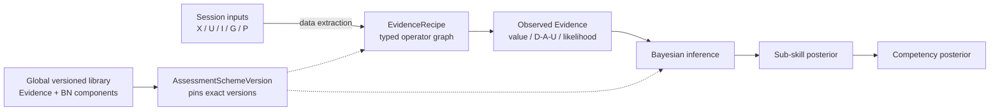

# Pilot Assessment System

面向飞行训练领域专家的 Windows 本地评估模型设计与运行系统：把多模态仿真 session 转换为可观测 Evidence，再用专家可编辑的 Bayesian Network 推断飞行员的 sub-skill 与 competency 后验分布。

本项目对应课题 **Development of AI-Based System for Evaluating eVTOL Pilot Training Effectiveness**。它首先是一套让专家设计评估方法的平台，不是一套已经证明科学有效的固定评分标准。

## 系统设计逻辑



运行时计算顺序是：

```text
session 数据 -> Evidence 提取 -> Evidence observation -> BN posterior inference -> 能力结果
```

BN 本身的概率图不能与这个程序执行顺序混为一谈。Starter 模型使用标准生成式方向：

```text
Competency --probability--> Sub-skill --probability--> Evidence
```

它表示 `P(child | parents)` 的概率分解。实际评估观察 Evidence 后，再计算 `P(Sub-skill, Competency | Evidence)`。前端可以用只读 overlay 显示 `Evidence ⇢ Sub-skill ⇢ Competency` 的后验信息影响，但不会为了显示而反转存储的 BN 箭头。

## 三类节点、两类边

| 元素 | 含义 |
|---|---|
| Raw Input node | X(t) 飞行状态、U(t) 操纵输入、I(t) VR 第一视角、G(t) gaze/AOI、P(t) EEG/ECG 等数据源；不属于 BN，也没有 CPT |
| Evidence node | 用 `EvidenceRecipe` 从 session 提取的可观测变量，并通过 observation binding 进入 BN |
| BN node | sub-skill、aggregate competency 或专家定义的其他随机变量 |
| Data / extraction edge | `Raw Input -> Evidence`；只表达数据和计算依赖 |
| Probabilistic BN edge | `BN parent -> child`；表达 child CPD/CPT 的条件依赖 |

Evidence 节点的 Inspector 必须同时让专家看到两件事：

1. 它如何从原始数据提取，包括输入、窗口、算子、公式、参数、聚合和 scorer；
2. 它如何在 BN 中被解释，包括 observation states、probabilistic parents 和 CPT/likelihood。

这两组关系使用不同的数据合同、编辑操作、图形样式和校验器。

高层 extraction graph 不使用 `Evidence -> Evidence` 或 `BN Node -> EvidenceRecipe` 作为数据边。复用计算通过 Evidence 内部的通用 operator/subgraph 或可追溯到 raw/task source 的 typed derived artifact 完成；Evidence 之间若存在概率关系，则必须作为带 CPD/CPT 的 probabilistic BN edge 明确建模。

## 全局组件库与任务方案

系统不是为每种任务复制并覆盖一整套模型，而是维护一个全局、不可变、可追溯的版本库：

- `EvidenceConcept` 表示“测量什么”；
- `EvidenceVersion` 表示一种精确计算方法；
- `BnNodeConcept` 表示一种能力变量；
- `BnNodeVersion` 表示其精确 states、parents 与 CPD/CPT；
- `TaskProfileVersion` 表示任务上下文、期望轨迹/包线、phase/event/AOI；
- `AssessmentSchemeVersion` 选择并锁定上述组件的确切版本。

例如，“轨迹偏差”可以同时存在 Hover 版、直线保持版和其他专家版。Hover 方案选择自己的版本，直线保持方案选择另一个版本；二者并列存在，不互相覆盖。

发布遵循 copy-on-write：

1. 专家可以从 starter 或任意历史方案创建 draft；
2. 未修改的组件继续引用原 exact version；
3. 修改的组件形成新候选 version；
4. 点击“应用到后续评估”后，后端只做最小技术校验；
5. 新组件 versions 与新 scheme version 原子发布；
6. 旧方案和历史 run 永远锁定原 ID 与 content hash。

方案不使用会漂移的 `latest`。同一任务可以有多套方案，多个任务也可以共享完全相同的组件版本。

## 专家最终可以修改什么

在完整 Windows 产品中，专家应能直接在可视化工作区中：

- 新增、复制、停用、恢复或移除 Evidence；
- 修改 Evidence 输入、窗口、通用算子、参数、公式、聚合和 D/A/U/soft scorer；
- 展开 Evidence 内部 operator graph；
- 新增、删除和连接 BN nodes；
- 修改 state space、probabilistic parents 和 CPT；
- 浏览全局组件的所有并行 versions；
- 为不同任务组合并发布不同方案；
- preview 当前 draft，并比较或重放历史版本。

普通修改不需要发布新的 Python whole-Anchor plugin，也不需要人工审批或逐次运行开发测试。只有现有 operator library 无法表达一种全新计算能力时，开发者才增加 trusted operator plugin。

## 数据接口

正式 session contract 为多模态设计：

| 概念接口 | 典型内容 |
|---|---|
| X(t) | 位置、姿态、速度、加速度和其他飞行状态 |
| U(t) | 操纵杆、踏板、推力和控制器输入 |
| I(t) | 随飞行员头部转动变化的 VR 第一视角画面 |
| G(t) | gaze ray/point、stare、fixation、AOI 与置信度 |
| P(t) | EEG、ECG 及未来声明的其他生理模态 |
| pilot_camera(t) | 可选的驾驶员脸部/身体画面；不等同于 I(t) |

任务 reference、phase/event annotations、AOI 和期望轨迹由版本化 task profile 提供。当前 repository-external CSV 只用于理解采集格式和验证接口；它不是标准飞行轨迹、任务 ground truth 或能力证据。

## 差表现与缺失数据

系统不研究“飞得差是不是数据质量差”。进入 Evidence 层的数据假定已满足上游文件、schema、字段和时间合同：

- 轨迹偏差大、控制剧烈、生理数值极端、未响应、未恢复或未注视，应按专家规则形成负面 Evidence，通常是 `computed + Unacceptable`；
- `computed + Unacceptable` 是有效 observation，不是 missing，也不会被过滤；
- 只有输入确实缺失、任务不适用、配置/依赖不足或软件错误，才使用对应的非 computed 状态；
- coverage 表示所需 Evidence 是否形成并被采用，不表示表现好坏。

## 当前实现状态

截至 2026-07-16：

| 里程碑 | 状态 |
|---|---|
| M1 Backend Foundation | 已工程验证 |
| M2 Multimodal Synthetic Foundation | 已工程验证 |
| M3 Native-Rate Time Synchronization | 已工程验证 |
| M4R Editable Evidence Computation Foundation | 已工程验证；canonical `EvidenceRecipe`、typed operators、compiler/executor、draft/preview/apply/replay 与 18 个 starter recipes 已实现 |
| M5 Shared Model Library and Bayesian Workspace | 已工程验证；global immutable component library、exact-pinned scheme、draft/undo/redo、copy-on-write atomic publish、通用 CPT、finite-discrete exact inference、M4R migration、Hover starter package 与 lightweight preview/publish/replay workflow 已完成 |
| M6 Local Runtime / Persistence / Protocol | 正式规格已批准、实施计划编制中；生产代码尚未实施 |
| M7 WinUI Expert Designer | 尚未实施 |
| M8 Packaging / Handoff | 尚未实施 |

当前 18 个 Evidence、11 个 sub-skills、4 个 competencies 和 Hover BN 都只是 `starter_template` / `engineering_default`。通用代码、schema、API、UI 和测试不得依赖这些数量、名称或连接。完整产品仍是 `in_progress`，`formal_run_authorized=false`。

## 从这里开始阅读

1. [M5 Shared Versioned Model Library and Bayesian Workspace Design](docs/product/specs/2026-07-16-m5-shared-versioned-model-library-and-bayesian-workspace-design.md) — 当前已确认的系统核心模型与 BN 语义。
2. [M5 Implementation Plan](docs/product/plans/2026-07-16-m5-shared-versioned-model-library-and-bayesian-workspace-implementation-plan.md) — 已完成的 inline 实施、验证与交接记录。
3. [产品设计文档中心](docs/product/README.md) — 全部正式文档、阅读顺序与权威规则。
4. [产品总览](docs/product/01_PRODUCT_OVERVIEW.md) — 用户、工作流和总体架构。
5. [Expert-Editable Evidence and Assessment Model Design](docs/product/specs/2026-07-15-expert-editable-evidence-and-model-design.md) — M4R–M8 expert-designer 重基线。
6. [Implementation Status](docs/product/11_IMPLEMENTATION_STATUS.md) — 真实代码状态、验证证据和下一步。
7. [Decisions](docs/product/DECISIONS.md) 与 [Glossary](docs/product/GLOSSARY.md) — 已锁定口径和术语。

## 目录

```text
src/pilot_assessment/     # Python Core
tests/                    # 轻量平台不变量、合同与工作流测试
schemas/                  # 确定性生成的跨语言 JSON Schema
docs/product/             # 当前产品基线、里程碑规格、计划与复核记录
```

`docs/product/specs/` 保存状态受控设计，`docs/product/plans/` 保存已批准规格的实施步骤；计划不能覆盖正式规格或 `DECISIONS.md`。

## 开发验证

安装 [uv](https://docs.astral.sh/uv/) 后，在本目录运行：

```powershell
uv sync --all-groups
uv run python -m pilot_assessment.schemas.export
uv run pytest -q
uv run ruff check .
uv run ruff format --check .
uv run ty check src
uv build
```

这些命令验证软件合同和执行路径，不证明任何 Evidence、阈值、CPT 或能力结论科学有效。详细验证数字见 [Implementation Status](docs/product/11_IMPLEMENTATION_STATUS.md)。

## 产品边界

- Windows 原生前端：WinUI 3；
- 本地后端：Python Assessment Core；
- 进程桥接：JSON-RPC 2.0 / JSONL over stdin/stdout；
- 大型数据通过 session bundle 路径、manifest 和 checksum 读取，不进入 JSON 消息；
- 前端提交 domain operations，后端返回并保存 canonical state；
- 软件验证与科学验证始终分别记录；
- v0 不用于执照、医疗、适航认证或实时机载决策。
