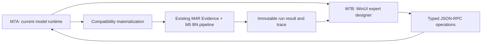

# M7 WinUI Expert Designer Implementation Roadmap

> **For agentic workers:** Execute this roadmap INLINE, one task at a time. Do not spawn subagents. Use the two linked implementation plans as the executable checklists and stop at their explicit gates.

**Goal:** Deliver the M7 expert-design product surface without preserving the obsolete Draft/Publish workflow in the normal UI: first migrate the Python backend to current complete nodes and task activation, then build the Windows WinUI expert workspace against those typed operations.

**Architecture:** M7 is split into M7A and M7B. M7A owns canonical `ModelNode`/`TaskScheme` state, dependency closure, atomic node/CPT edits, automatic immutable run snapshots, compatibility materialization and JSON-RPC methods. M7B owns process hosting, typed transport, task navigation, the active/dim graph, floating node editors, autosave/conflict UX, bilingual resources and run/result presentation. M7B never reimplements Evidence or BN calculation logic.

> **2026-07-18 applicability note:** Tasks 1–15 below remain historical implementation evidence. D-056/D-057 now insert a backend-managed durable edit session before canonical state, move canonical commit to the main-window Save all choice, add global undo/redo and replace the old graph filter/lane semantics with the five-layer canvas. See the [approved amendment](../specs/2026-07-18-m7-staged-edit-session-and-five-layer-canvas-amendment.md) and its [completed implementation plan](2026-07-18-m7-staged-edit-session-and-five-layer-canvas-implementation-plan.md).

**Tech Stack:** Python 3.11, Pydantic 2, SQLite, existing M4R/M5/M6 runtime, JSON-RPC 2.0 over JSONL stdio, C#/.NET 10, WinUI 3, Windows App SDK, CommunityToolkit.Mvvm, Microsoft.Extensions.Hosting, System.Text.Json source generation, xUnit.

---

| Field | Value |
|---|---|
| Milestone | M7 |
| Date | 2026-07-17 |
| Status | M7A and M7B engineering verified; M7 exit gate closed |
| Authoritative design | [M7 WinUI Expert Designer and Task Activation Workspace Design](../specs/2026-07-17-m7-winui-expert-designer-and-task-activation-workspace-design.md) |
| Decisions | D-047–D-053 |
| Upstream | M1–M3, M4R, M5 and M6 engineering verified |
| Downstream | M8 integration, distribution packaging and handoff |
| Scientific boundary | Starter algorithms, thresholds and CPTs remain unvalidated; `formal_run_authorized=false` |
| Execution policy | INLINE only; lightweight platform tests; no scientific golden expansion |

## 1. Why M7 is split

The approved M7 design changes the editing semantics already implemented by M5/M6. A WinUI client built directly on the old `component.version.*`, `scheme.draft.*` and publish-only run methods would reproduce the wrong product:

- a visible node would still act like a concept/version selector instead of one complete current definition;
- task switching would pin alternate versions instead of selecting independent global nodes;
- the user would still need Draft/Apply/Publish before evaluation;
- enable/disable closure and node-only copy semantics would exist only as front-end decoration;
- a run could not atomically freeze the exact current scheme and node definitions.

M7 therefore has two ordered increments:

M7A must close its compatibility and run-snapshot gate before M7B makes the new model workspace its default path. M7B may scaffold its process client after the M7A contracts are frozen, but it must not invent transport fields while M7A is still changing them.

## 2. M7A deliverable — Current Model Runtime

Executable plan: [M7A Current Model Runtime Implementation Plan](2026-07-17-m7a-current-model-runtime-implementation-plan.md).

**Completion status (2026-07-17):** M7A Tasks 1–12 are implemented and the exit gate is closed. Fresh evidence is `42 passed` for current-model/sidecar/integration, `151 passed` for compatibility, `1684 passed, 3 skipped` for the full repository, 51-schema zero drift, successful Ruff/format/ty/build checks and a repository-external installed-wheel smoke. This closes only the backend/current-model gate; it does not mean a WinUI window exists.

M7A delivers:

1. strict cross-language contracts for complete raw-input, Evidence and BN nodes;
2. a mutable `TaskScheme` that stores explicit activation and a computed parent closure;
3. SQLite schema v2 and append-only change history without exposing business versions;
4. autosave-oriented node/scheme create, update, copy, archive, undo and redo operations;
5. graph projection from node definitions, never an independent ghost-edge store;
6. silent recursive parent activation and previewed/confirmed atomic downstream deactivation;
7. parent/state/CPT operations that save or roll back as one unit;
8. deterministic migration of the existing Hover starter into the current model workspace;
9. preview, preflight and run-from-current-scheme operations;
10. a new immutable current-model run snapshot while retaining old run replay;
11. additive JSON-RPC methods and explicit compatibility classification of old APIs;
12. one small end-to-end workflow proving edit → snapshot → Evidence → BN → replay.

M7A does not:

- remove or rewrite old immutable component records, published schemes or historical run snapshots;
- add task-specific branches to the generic executor;
- validate whether starter Evidence/CPT values are scientifically reasonable;
- generate production visual, gaze, EEG or ECG data;
- build any Windows UI or packaging.

### 2.1 M7A exit gate

M7A is complete only when all of the following are true:

- one 5–8 node micro graph proves activation closure, deactivation cascade and task isolation;
- node copy creates a new complete node and retains the original fixed parents;
- two schemes may share one node, and later node edits affect future runs but not an old snapshot;
- a parent/state/CPT edit is atomic and its failure leaves the old node unchanged;
- the Base Scheme is seeded idempotently from the existing Hover starter;
- the new sidecar methods work over a real subprocess with stdout containing protocol JSON only;
- a current scheme can preflight, freeze an immutable snapshot, execute through the existing pipeline and reopen its result;
- old `RunSnapshot`/published-scheme replay tests still pass;
- focused tests, full Python tests, schema zero-drift, Ruff, formatting, `ty check`, build and external-wheel smoke pass.

## 3. M7B deliverable — WinUI Expert Designer

Executable plan: [M7B WinUI Expert Designer Implementation Plan](2026-07-17-m7b-winui-expert-designer-implementation-plan.md).

**Completion status (2026-07-17):** M7B Tasks 1–15 are implemented and the M7 engineering exit gate is closed. The visible Windows application includes the managed project/session workspace, parallel task-scheme navigation, the backend-projected active/dim global graph, atomic graph editing, independent node windows, complete Raw Input/Evidence editors, BN state/fixed-parent/CPT editors, durable 350 ms form autosave with per-object ordering/idempotent retry/canonical rebase/Reload-Reapply recovery, immediate Chinese/English switching, and backend-owned current-model preflight/run/cancel/recovery/result/trace/diagnostics. A real visible vertical slice recovered the same immutable result after restart and displayed 18 Evidence observations, 4 posterior variables and 39 managed artifact references. The completion gate passed desktop Unit `84/84`, real-sidecar Contract `4/4`, x64 Debug build `0 warning / 0 error`, a 1,000-node viewport-culling projection, responsive logical-width checks, accessibility/theme/focus checks, simultaneous node windows, protocol-only stdio and zero app/sidecar TCP listeners. M8 packaging remains deferred and scientific calibration remains undone.

M7B delivers:

1. an unpackaged development WinUI 3 application and test solution;
2. a supervised local Python sidecar process with JSONL framing, capability handshake and stderr diagnostics;
3. typed C# contracts generated/maintained from M7 schemas, with `JsonNode` limited to schema-driven parameter values;
4. project creation/opening, managed session import/exploration and backend status;
5. a task-scheme sidebar with create/copy/rename/archive/switch operations;
6. a scalable global Raw Input/Evidence/BN graph with active/dim states and two edge types;
7. graph activation, cascade-deactivation dialog, drag layout, create/connect/disable and copy/paste;
8. multiple independent movable, resizable and maximizable node windows;
9. schema-driven EvidenceRecipe/operator/parameter/scoring and BN state/CPT editors;
10. autosave queues, canonical response reconciliation and visible revision-conflict recovery;
11. immediate Chinese/English UI switching plus bilingual model metadata fallback;
12. preview, preflight, run progress/cancel, posterior, trace, artifact and audit views;
13. a small unit/contract/launch verification suite and an actual visible top-level window check.

M7B does not:

- duplicate Python operator, EvidenceRecipe, CPT migration or BN inference algorithms in C#;
- directly edit Python source files;
- add Draft, Published, Apply or Publish to the normal workflow;
- package the final backend/runtime/application distribution;
- embed user session data in the product;
- run heavy scientific end-to-end datasets for each UI edit.

### 3.1 Toolchain gate

The current workstation audit found the Windows SDK but no usable `dotnet` command, Visual Studio installation or WinUI template. This does not block M7A. Before M7B Task 1 changes the machine, the implementer must:

1. record the non-mutating audit;
2. stop for explicit user authorization to install the WinUI development prerequisites;
3. after authorization, run the bundled `winui-app` WinGet configuration from its own directory;
4. verify `dotnet --list-sdks` and `dotnet new list winui` before scaffolding.

The development app is intentionally unpackaged so command-line build and direct executable launch are testable. M8 will make the final distribution choice and bundle the backend runtime.

### 3.2 M7B exit gate

M7B is complete only when all of the following are true:

- the client launches and shuts down the sidecar without a network listener;
- task switching changes active/dim state from backend canonical graph snapshots;
- enabling a child consumes the backend closure response without an extra confirmation;
- parent deactivation displays the backend impact set and Continue/Cancel has the exact specified effect;
- node and scheme copy are visible immediately and persist after application restart;
- two node windows can remain open and independently save or resolve revision conflicts;
- Evidence parameters and BN CPT edits change backend state and affect later preview/run snapshots;
- language switching refreshes currently visible shell/editor strings and model metadata without changing IDs or hashes;
- run progress, cancellation, posterior and trace are visible;
- unit tests, a real Python sidecar contract smoke, .NET build and an actual visible-window launch check pass.

## 4. Ordered execution and commit boundaries

| Order | Plan | Commit groups | Blocking gate |
|---:|---|---|---|
| 1 | M7A Tasks 1–3 — completed | contracts, graph rules, SQLite v2 | schemas and migration reopen cleanly |
| 2 | M7A Tasks 4–8 — completed | node/scheme services, activation, CPT, starter migration | current workspace is fully editable and durable |
| 3 | M7A Tasks 9–12 — completed | preview/run bridge, sidecar, vertical slice, completion gate | M7A exit gate closed |
| 4 | M7B Task 1 — completed | toolchain audit/install/scaffold | explicit authorization obtained; scaffold builds |
| 5 | M7B Tasks 2–5 — completed | contracts, process client, host, project/session shell | sidecar contract smoke passes |
| 6 | M7B Tasks 6–13 — completed | task sidebar, graph, commands, windows, editors, autosave, live bilingual UI | model editing vertical slice persists and language remains presentation-only |
| 7 | M7B Tasks 14–15 — completed | run/results, accessibility/performance, completion gate | visible window and M7 exit gate closed |

All seven ordered groups are complete. Task 15 code/test commit is `d1dbdd2`; its documentation closeout follows as a separate documentation-only commit so the ledger can record the immutable code hash.

Each task uses its own focused test and commit. Small corrective changes may share the task commit when they are directly required by that task. Do not batch the entire milestone into one unreviewable commit.

## 5. Validation policy

M7 validates platform behavior, not scientific truth.

Required:

- strict DTO/schema parsing and canonical hashing;
- transaction, idempotency and optimistic-revision behavior;
- dependency closure and task isolation;
- node/CPT atomicity;
- immutable snapshot and legacy replay;
- JSON-RPC framing, typed client mapping and recovery actions;
- UI view-model, localization fallback and window-registry behavior;
- one tiny managed-session/current-scheme execution smoke;
- actual WinUI top-level window launch.

Explicitly excluded:

- four long synthetic datasets or ten-thousand-row modality fixtures;
- per-edit pytest/golden execution from the front end;
- scientific pass/fail or expert-quality assertions for O1–O13/H1–H5;
- calibration of thresholds, topology or CPTs;
- testing the absent final installer during M7.

## 6. Compatibility and rollback

- SQLite v2 is additive. Opening a project applies v2 once; old v1 data remains in place.
- Current nodes/schemes are new canonical records. Legacy components/schemes remain readable and are used by deterministic compatibility materialization where the existing pipeline needs them.
- `RunSnapshot` v0.1 remains parseable. Current runs use a new versioned snapshot contract rather than modifying historical bytes in place.
- Old JSON-RPC methods remain available as compatibility/migration methods. The M7 client uses only the new `model.*` current-workspace methods for normal editing.
- If M7B is unavailable, M7A is still independently testable through its Python API and sidecar.
- No M7 task deletes user projects, imported sessions, historical runs or old component records.

## 7. Completion handoff

M7A and M7B have passed their gates. Completion handoff records:

1. update `docs/product/11_IMPLEMENTATION_STATUS.md` with exact fresh test/build/launch evidence;
2. update this roadmap and both executable plans with actual task commits;
3. record any changed product semantics in `DECISIONS.md` before changing the specifications;
4. keep starter/synthetic runs marked scientifically unsupported;
5. M8 planning may now begin, but no M8 packaging implementation or scientific-validity claim is implied by M7 completion.

**2026-07-18 user-acceptance clarification:** the completion above is the M7 engineering gate, not the user's final acceptance of the actual product workflow. The user will manually exercise M7 and may request M7 repairs. M8 therefore remains limited to a non-executable pre-UAT outline until that acceptance and any required repairs are closed.
