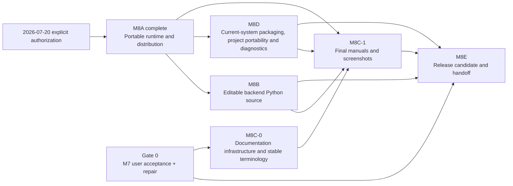

# M8 Pre-UAT Implementation Outline

> **For agentic workers:** REQUIRED execution mode is **INLINE**. This file remains the M8 roadmap rather than a file-level task list. The user explicitly authorized M8 execution on 2026-07-20；M8A、M8B 与 M8C-0 已分别按正式计划完成。2026-07-21 D-077 取消专用 backup/restore 产品并重定义 M8D。Do not infer that M7 user acceptance, M8C-1, M8D or M8E gates are complete.

| 字段 | 值 |
|---|---|
| 计划类型 | Pre-UAT implementation outline |
| 日期 | 2026-07-18 |
| 状态 | **路线图已批准；M8A、M8B、M8C-0 已完成，M8D current-system packaging/portability 为下一阶段；M8C-1/M8E 待实施** |
| 设计来源 | [M8 Productization, Editable Python Source, Documentation and Handoff Design Outline](../specs/2026-07-18-m8-productization-editable-python-documentation-and-handoff-outline.md) |
| 边界 | 用户授权 M8A 先行；M7 人工验收仍是 M8E 最终候选的硬前置条件 |
| 执行方式 | 后续默认 INLINE、小型垂直切片、选择性轻量验证 |
| 当前动作 | 复核 [M8D Current-System Packaging, Project Portability and Diagnostics Design](../specs/2026-07-21-m8d-current-system-packaging-project-portability-and-diagnostics-design.md)，随后制定正式实施计划 |

## 1. 计划目的

本路线图把 M8 拆成可管理的阶段，并说明每一阶段的目标、依赖、候选产物、轻量验证和停止条件。它用于：

1. 防止 M8 被误解为“只做一个 ZIP”；
2. 防止 live Python source、current system、文档和交付在最后临时拼接；
3. 让 M7 用户验收的反馈先进入最终产品合同；
4. 在不提前锁死实现细节的情况下，形成完整的后续开发顺序；
5. 保持软件产品化与专家科学校准互相独立。

本文件不包含具体源文件、测试文件、命令、代码片段或提交号。M8A 已由用户于 2026-07-20 单独授权先行，并通过对应正式规格、实施计划和验收记录完成；其余工作流继续由各自正式文件收口。

## 2. 总体依赖关系



默认顺序是：

1. M8A 已按用户单独授权先稳定便携 runtime、目录和启动链；
2. 继续完成 M7 用户验收与返修，并把结果作为 M8E 前置输入；
3. 在稳定 runtime 上保证第一方 Python 源码直接可编辑、全局生效，并实现项目迁移；
4. 文档基础设施可以较早建立，但最终内容、截图和路径必须等功能稳定；
5. 最后只通过一条统一 release pipeline 生成并验收交付物。

## 3. Gate 0 — M7 用户验收与返修

### 3.1 目标

由用户亲自验证当前产品是否符合真实操作预期，确保 M8 不为错误或尚待调整的 M7 界面制作最终打包和手册。

### 3.2 输入

- 当前 M7 WinUI development build；
- 一个用户可理解的受管项目；
- 一个轻量 canonical Session Bundle 与一个只含 `streams/`/`annotations/` 的 raw source；
- 当前 M7 规格、操作路径和工程完成证据。

### 3.3 验收路径

| 场景 | 用户应确认的结果 |
|---|---|
| 启动与项目 | 主窗口可用，项目创建/打开/最近项目行为符合预期 |
| Session | canonical/raw 自动识别、受管导入、模态状态、未声明单位和引用信息清楚 |
| 任务方案 | 创建、复制、切换、重命名、归档直观且持久 |
| 全局图 | 五层 active/dim、两类底层边、层级筛选、缩放、长按拖动和选择清楚 |
| 节点窗口 | 多窗口可并排、移动、缩放、最大化并恢复 |
| Evidence | recipe、operator、参数、输入、评分和 trace 可理解、可编辑 |
| BN/CPT | parent、state、CPT 与 posterior/influence 区分清楚 |
| 复制与激活 | copy/paste、parent reuse、closure 和 cascade 符合已确认语义 |
| 保存与冲突 | 后端持久草稿、Ctrl+Z/Ctrl+Y、异常恢复、关闭时保存全部/放弃全部/取消以及冲突状态可以理解 |
| 运行与结果 | preflight、run、progress、result、trace、diagnostics 可使用 |
| 语言与易用性 | 中英文、键盘、主题、窗口布局和提示满足实际使用 |

### 3.4 产物

- M7 用户验收记录；
- 缺陷、UX 返修、术语调整和新需求分类；
- 返修后的 fresh focused tests/build/visible smoke；
- M7 最终用户操作路径和稳定截图清单；
- 对 M8 候选设计的变更清单。

### 3.5 停止条件

若用户仍认为核心操作方式需要改变，则继续完成 M7 返修。2026-07-20 的明确授权允许 M8A 工程 package 与 live-source layout 先行；最终手册截图、clean-machine acceptance 和 M8E 候选仍不得绕过 M7 用户验收。

## 4. M8A — Portable Runtime and Distribution

### 4.1 目标

把当前依赖开发机、仓库和开发运行时的 WinUI + Python sidecar，转换为 Windows x64 解压即用、自包含、可诊断的产品目录。

### 4.2 候选范围

1. 冻结 Windows、.NET、Windows App SDK、Python 和 Python wheels 的精确 release toolchain；
2. 定义 release layout、manifest、checksum、版本、live source tree 和启动发现合同；
3. 构建隔离私有 Python runtime；
4. self-contained 发布 WinUI/.NET/Windows App SDK；
5. 让应用从 `AppContext.BaseDirectory` 发现产品 runtime 和 `backend/src`，而不是向上搜索开发仓库或隐藏 wheel；
6. 保留明确的 development launch mode，但不让它进入普通产品路径；
7. 建立单一 portable build pipeline；
8. 扫描并阻止用户数据、开发缓存、绝对路径和临时文件进入 release；
9. 生成 release manifest、checksums、licenses 与基础 SBOM；
10. 从仓库外普通目录完成启动、关闭和一次 sidecar handshake。

### 4.3 候选产物

- release layout contract；
- exact toolchain/dependency lock；
- private Python runtime builder；
- WinUI self-contained publish profile；
- production backend locator 与 development locator 分离，并保证 production locator 直接运行发布目录中的可编辑 source tree；
- portable build/verify scripts；
- product ZIP 候选；
- M8A verification record。

### 4.4 轻量验证

M8A 不重新运行所有科研样例。它只需证明：

- 在没有仓库路径的目录中启动；
- 不依赖系统 `python`、`dotnet`、`uv` 或 Visual Studio；
- 修改 release 副本中的第一方 `.py` 后，重启使用修改后的源码而不是隐藏旧实现；
- sidecar handshake、日志分流和关闭正确；
- app/sidecar 不监听 TCP；
- 产品目录是只读时，用户项目仍写到用户选择的位置；
- release manifest 与实际文件/hash 一致；
- 包内不含 session/project/result/private path。

### 4.5 M8A 退出门

- 一个解压目录能在目标 Windows 环境启动完整 shell；
- 能创建项目、导入一个外部轻量 bundle 并完成现有 M7 smoke；
- 重启后项目仍可打开；
- runtime 和 backend 错误能进入可读 diagnostics；
- release layout 已稳定，足以供 M8B/M8D current-system capture 引用。

### 4.6 明确排除

- 安装器、MSIX、应用商店、自动更新；
- 单文件压缩执行；
- 把用户项目放进应用目录；
- 依赖开发者机器的 Conda 或 `.venv`；
- 科学 calibration。

## 5. M8B — Editable Backend Python Source

> **2026-07-21 execution update：** 用户已批准 D-066–D-071。M8B-0 已把 current ModelNode/TaskScheme/edit session 提升到每套软件副本的 `system/`；M8B-1 已冻结 loaded source/runtime/dependency/operator identity 与 RunSnapshot source artifact；M8B-2 已关闭普通 Python operator、私有依赖工具、通用 schema UI 与 release-copy run 闭环。详见 [M8B 正式规格](../specs/2026-07-21-m8b-system-owned-model-library-and-editable-backend-provenance-design.md)、[M8B-2 计划](2026-07-21-m8b2-python-operator-extension-handoff-implementation-plan.md) 与 [M8B-2 Verification](../reviews/2026-07-21-m8b2-python-operator-extension-verification.md)。本段早期把 canonical model/edit session 默认为 project-owned 的措辞均由该规格取代。

### 5.1 目标

把完整第一方 Python backend 作为发布包中唯一活动、普通文件形式、可由专家直接修改的源码树。现有方法无法达到新目标时，专家用任意编辑器修改源码并重启；不建设内置代码编辑器、源码修改 API、Extension Manager 或项目级源码覆盖层。

### 5.2 两层修改边界

- 参数、recipe 组合、Evidence/BN nodes、parents、states、CPT 和 TaskScheme 仍由专家在 WinUI 中修改，并通过现有 protocol 保存 backend canonical state；
- 只有现有 operators/core 无法表达目标时，才编辑 `backend/src/pilot_assessment/`；
- 源码修改作用于当前解压软件副本的全部项目、任务和未来 run；
- 若需要并列保留另一套 backend core，复制整套软件目录，而不是在项目中切换 source version；
- C# 不实现或复制 Python operator/BN 算法。

### 5.3 候选范围

1. 冻结 release 中唯一活动 source root 和 Python import/launch contract；
2. 以普通 `.py` 完整交付 `pilot_assessment`，不采用隐藏 wheel、zipimport、混淆或 compiled-only first-party backend；
3. 同包暴露 `pyproject.toml`、dependency lock、schemas、starter resources、build scripts 和 C# source；
4. 提供固定版本的私有 Python 依赖管理工具，但不提供内置源码编辑 UI；
5. 让 baseline integrity 和 local modification 状态分离：偏离官方 hash 只标记，不阻止运行；
6. 启动和 run preflight 计算当前 backend source tree identity；
7. RunSnapshot 记录 source/runtime/dependency/operator identities；
8. 每个新的 source hash 首次运行时保存 content-addressed source snapshot artifact；
9. 文档完整说明修改已有 operator、新增 operator、增加依赖、修改 core/adapter/protocol、重启、恢复和升级；
10. 用 release 副本完成一次“新增最小 operator → 注册 → 重启 → 前端使用 → run → source identity 保存”的轻量闭环。

### 5.4 普通专家流程

```text
前端打开节点
  -> 修改 parameters / recipe / parents / states / CPT / task activation
  -> typed domain intent 持久暂存到 Python edit session
  -> 关闭主窗口时选择“保存全部”原子更新 canonical state
  -> 后续 run 自动冻结 RunSnapshot
```

该流程不需要打开源码，也不因修改参数而运行开发测试。

### 5.5 源码修改流程

```text
确认现有 operator/core 无法表达目标
  -> 关闭应用和 sidecar
  -> 复制软件目录或保留原始 ZIP
  -> 用任意编辑器打开 backend/src/pilot_assessment
  -> 修改/新增 Python 实现与必要 metadata
  -> 如有新依赖，更新当前私有 runtime 和 dependency lock
  -> 重启应用
  -> 从 diagnostics 查看 syntax/import/contract 错误
  -> 用一个微型 Evidence/BN 路径检查新能力
  -> future run 自动记录 source identity
```

M8 正式手册必须把上面每一步映射到最终真实目录、模块和命令。

### 5.6 新 operator 的明确路径

后续可执行计划必须围绕当前真实结构说明：

- implementations/definitions 位于 `backend/src/pilot_assessment/evidence/builtins/`；
- registry 位于 `backend/src/pilot_assessment/evidence/registry.py`；
- built-in registration 位于 `backend/src/pilot_assessment/evidence/builtins/__init__.py::register_builtin_operators()`；
- operator 必须提供 callable 和 `OperatorDefinition`；
- `parameter_schema` 和 UI hints 驱动现有前端表单；
- 注册后重启 sidecar，operator catalog 即反映当前源码；
- 新 operator 可与旧 operator 并列使用，不要求覆盖旧实现。

### 5.7 轻量验证

需要验证的是自由修改路径和可追溯性，不是新算法的科学正确：

- production sidecar 确实从 exposed source root 导入；
- 修改 `.py` 后重启即生效；
- 没有 project-specific source overlay 或隐藏优先实现；
- baseline/source hash 与 `locally_modified` 状态正确；
- 一个新 operator 能注册、显示、配置和运行；
- syntax/import 错误完整显示且不静默回退；
- historical result 不被覆盖；new run 锁定当前 source snapshot；
- 恢复原始 ZIP 后可回到官方 baseline。

### 5.8 M8B 退出门

- 发布目录完整暴露第一方 Python backend 和构建 metadata；
- 一位具备 Python 能力的专家仅依据手册即可修改现有 operator 或新增 operator；
- 无需修改 WinUI、调用特殊 API 或发布 plugin package；
- 重启后修改全局作用于当前软件副本；
- 前端普通参数/CPT/task 编辑仍完全按 M7 路径工作；
- source divergence 不阻止运行，但 new RunSnapshot 可回答由哪份代码产生；
- 失败可以通过修复源码或重新解压干净系统恢复。

### 5.9 明确排除

- 内置 IDE、Python REPL、远程 shell 或 code-execution RPC；
- 每项目独立 backend source；
- 强制代码审查、强制发布流程或 per-save test gate；
- `.paext`、plugin marketplace 或 dynamic plugin loader 作为首个 M8 完成条件；
- 为专家新算法提供科学认证。

## 6. M8C — Documentation and DOCX Pipeline

### 6.1 目标

建立一套可维护、可生成、可版本化、可供不同角色快速使用的正式文档系统，并把最终 DOCX 随产品交付。

### 6.2 工作分层

M8C 分成两段：

**M8C-0：基础设施和结构**

- 文档 metadata/schema；
- 文档 catalog 与 stable IDs；
- Markdown 目录与 shared fragments；
- DOCX reference template；
- pinned documentation toolchain；
- Mermaid/C4 rendering；
- cross-reference、TOC、version、screenshot manifest；
- structural/privacy/link validation。

**M8C-1：最终内容和截图**

- 12 类手册的中文和英文内容；
- 最终 M7/M8 UI 截图；
- editable Python source、current-system packaging、project portability、release 等 M8 功能说明；
- 术语和 UI resource parity；
- 总册组合；
- 生成 DOCX 与 release copy。

> **2026-07-21 execution update：** M8C-0 已完成。12 类 catalog/schema、固定 Python/Node 工具链、DOCX template、Markdown parser、交叉引用、C4 assets、三份代表手册与 portable review-doc verifier 已通过；28 页代表手册已逐页检查。D-077 将未发布 backup 手册迁移为 portability 手册。M8C-1 仍等待 M7 UAT、M8D 与 M8E 的最终行为和截图，不得提前关闭。

### 6.3 内容生产顺序

| 顺序 | 内容组 | 原因 |
|---:|---|---|
| 1 | 产品边界、角色、术语、C4 context/container | 为所有后续手册提供统一概念 |
| 2 | 快速开始和普通用户路径 | 最早发现真实操作步骤是否不清晰 |
| 3 | Evidence/task 和 BN/CPT 专家手册 | 产品核心，必须与 M7 最终 UI 一一对应 |
| 4 | Canonical Bundle、simulator raw source 与 X/U/I/G/P reference | 合同相对稳定，可从 schema/profile 生成字段表 |
| 5 | Python operator/source 修改与 Python core | 等 M8B live source layout、identity 和依赖工具冻结后编写 |
| 6 | sidecar/C# 开发手册 | 等 portable lifecycle 和 live-source launch contract 冻结后编写 |
| 7 | system distribution/project portability/troubleshooting | 等 M8D 行为冻结后编写 |
| 8 | release/handoff | 等 M8E build/acceptance 流程确定后编写 |
| 9 | master technical reference | 从上述模块组合，不另写重复正文 |

### 6.4 轻量规范应用

- ISO/IEC/IEEE 26514 只指导用户、任务、结构、呈现和维护；
- ISO/IEC/IEEE 42010 只指导 stakeholder/concern/viewpoint 的架构表达；
- Diátaxis 用于标记 tutorial/how-to/reference/explanation；
- C4 以 context/container 为必选候选，component 只在有用时增加；
- 所有规范都不能覆盖项目真实合同、UI 和用户需求；
- 文档只声明“参考/对齐”，不声明标准符合性认证。

### 6.5 文档验证

候选自动检查包括：

- metadata 和 catalog 完整；
- Markdown 相对链接和 stable cross-reference 有效；
- UI 字符串/术语和手册名称一致；
- Mermaid/C4 图可渲染且含替代说明；
- DOCX package 可打开、目录/标题层级/页眉页脚/版本存在；
- 截图属于对应版本且无用户数据/绝对路径；
- 生成物不包含 `draft`、过期 product version 或未决占位；
- 总册章节来自模块化 source，不产生手工重复漂移；
- release docs 目录与 catalog/hash 一致。

### 6.6 M8C 退出门

- 十二类手册均有 Markdown source 和版本化 DOCX；
- 中文与英文的标题、范围、关键操作和 technical identities 对齐；
- 快速开始可由首次用户完成；
- 专家手册明确区分前端参数/模型编辑与 Python source editing，并覆盖 Evidence、BN、CPT、task、copy、activation、新增 operator 和 core 修改影响；
- 开发手册足以让接手者定位和修改 Python/C#/protocol/build；
- 总册自动组合、目录/交叉引用可用；
- 文档构建可重复，release 包只含最终输出。

## 7. M8D — Current-System Packaging, Project Portability and Diagnostics

### 7.1 目标

在不把用户数据打进产品包的前提下，使正式构建精确携带专家已经保存的 current system；同时证明完整 project 目录在软件关闭后可以复制、移动、重新打开，并让现有 Diagnostics 清楚说明 system/source/runtime/project 状态。

### 7.2 候选范围

1. `build_portable.py --system-source <path>` 显式 source contract；
2. system writer lock、clean shutdown、clean edit workspace、schema/integrity 和 user-owned-row checks；
3. SQLite-consistent canonical capture 与 clean target edit workspace；
4. manifest-driven model identity 和动态 node/scheme counts，移除 `53/1` 发布硬编码；
5. 无效 source 不得回退 starter seed；
6. 软件关闭后完整 project 目录 copy → open → historical result replay；
7. RunSnapshot source/runtime/operator identity、source snapshot artifact 和缺失依赖诊断继续有效；
8. 现有 WinUI Diagnostics 增补 current system identity/counts 与 project compatibility 状态；
9. `PAS-PORTABILITY-001` 和路线图/known-limitations 口径迁移；
10. disposable current-system package vertical slice。

### 7.3 关键不变量

- build 只读 source system，不改变其 canonical state；
- source system 必须已关闭且没有未保存编辑；
- 缺失或无效 source 时构建失败，不重新 seed；
- package 捕获实际 current model，不固定 starter 数量、名称或连接；
- 项目移动后使用相对受管引用，不依赖原电脑绝对路径；
- historical RunSnapshot 和 artifact hashes 保持不变；
- source/runtime/operator identities 明确，缺失历史 source snapshot 或依赖时给出可操作诊断；
- 不生成 support bundle；Diagnostics 不读取或复制 raw modalities、pilot-camera 或 participant identity；
- 产品升级不自动删除或覆盖旧软件目录、旧 runtime 或专家修改过的 live source tree。

### 7.4 轻量验证

- disposable system 修改一个 node/scheme 后保存、关闭并打包；目标 package identity/content 精确一致；
- dirty、locked、损坏、schema 不兼容或含 user-owned rows 的 source 被拒绝；
- package verifier 使用 manifest counts，不要求 `53/1`；
- 一个微型项目完成 close → directory copy → reopen → result replay；
- 缺失历史 source snapshot 或 runtime dependency 产生明确依赖诊断；
- package privacy/path scan 通过。

### 7.5 M8D 退出门

- 正式 builder 显式捕获已保存 current system，且不静默回退 starter；
- package 保留 current nodes/schemes/CPT/layout，且不包含 sessions/runs/results；
- 完整 project 在另一目录/设备上打开并保留 sessions/runs/results/artifacts；
- diagnostics 对普通用户可理解，对维护者足够定位问题；
- capture、portability、隐私和失败原子性验证通过。

### 7.6 明确排除

- `.paprojbackup`、`.pasystembackup`、Backup/Restore UI；
- 云同步、多用户合并、实时协作或自动更新旧副本；
- support archive、自动上传诊断、默认加密或密钥管理；
- 把多个项目合并为一个；
- 构建器猜测 system source 或在失败时隐式生成 starter。

## 8. M8E — Release Candidate and Handoff

### 8.1 目标

把 M8A–M8D 的结果通过同一受控 pipeline 组合为可交给另一位 Windows 用户和维护者的完整工程产品。

### 8.2 候选范围

1. 冻结 release version、toolchain lock 和 source identity；
2. 从 clean checkout 构建 app/runtime/resources/docs；
3. 生成 checksums、SBOM、licenses、notices 和 release notes；
4. 运行 release content/privacy/path scan；
5. 在 clean Windows environment 执行 portable acceptance；
6. 执行现有模型编辑和 lightweight run smoke；
7. 在 release 副本中执行“直接修改/新增 Python operator → 重启 → 前端配置 → run → source identity 保存”vertical slice；
8. 验证发布包携带选定 current system，并执行 project directory copy/move vertical slice；
9. 检查所有 DOCX、交叉引用和版本；
10. 形成用户最终验收记录和交付清单。

### 8.3 干净环境矩阵

正式 M8E 规格应至少冻结：

- 支持的 Windows build；
- 无 Visual Studio；
- 无 .NET SDK；
- 无系统 Python/uv/Conda；
- 普通用户权限；
- 含空格和非 ASCII 的解压/项目路径；
- 离线运行；
- 普通用户可写 app 目录中的源码修改场景，以及只读 app 目录中的 evaluator-only 运行诊断；
- 新项目与从完整目录副本重新打开的项目。

### 8.4 最终人工验收

自动化 gate 完成后，用户仍需亲自确认：

- 解压/启动路径足够简单；
- 核心 M7 设计体验没有因产品化退化；
- 专家能够根据文档判断何时使用前端、何时修改 Python，并能完成一次源码修改和恢复；
- current-system capture 与 project directory portability 符合预期；
- 文档分类和内容足以交给其他用户；
- known limitations 和 scientific status 表达准确。

### 8.5 M8E 退出门

- 一个最终 ZIP 通过 clean-machine matrix；
- 交付物可由另一位用户独立完成首次运行；
- 产品包无用户数据和开发机私有状态；
- release materials、DOCX、source identity 和第三方 notices 齐全；
- 最终用户验收完成；
- `formal_run_authorized=false` 仍准确，除非独立专家校准流程另有正式记录。

## 9. 跨工作流合同

### 9.1 路径与身份

- release 内部路径相对 app root；
- project 内部路径相对 project root；
- live Python source root 在当前 app root 下唯一确定，不存在 project source overlay；
- UI local state 不进入 project 或 release；
- source tree、runtime、operator、recipe、node、scheme、session 和 run 均使用稳定 identity/hash；
- 不把开发机绝对路径写入可迁移记录。

### 9.2 版本与兼容

- release manifest 记录 product/runtime/schema/protocol versions；
- project open 执行显式 schema compatibility/migration；
- source baseline manifest 记录官方 first-party source files/hashes；
- RunSnapshot 始终保留 exact source/operator/runtime identities；
- 旧项目、旧 snapshots、旧 source artifacts 和专家修改过的旧软件目录不因普通升级被静默覆盖。

### 9.3 错误与诊断

- 普通错误显示可行动的中文/英文说明；
- 技术详情以稳定 error ID、context 和 diagnostics 展示；
- sidecar stdout 继续只用于协议；
- runtime/source import/current-system capture/doc build 的失败都必须有明确阶段和恢复动作；
- 不用“质量差”过滤合法差表现数据。

### 9.4 安全与隐私

- 所有 ZIP 类输入检查 path traversal 和容量；
- 直接修改 backend source 意味着该软件副本会执行修改者的本地 Python 代码；这一能力是有意开放的，不经前端审批；
- release 执行隐私/路径扫描；M8D 不生成 support bundle；
- 默认离线、零监听端口；
- session 和项目数据保留在用户控制的位置。

## 10. 后续正式计划的拆分规则

Gate 0 关闭后，不把本大纲直接当作实施清单。应为每个工作流依次产生：

1. 一份状态为 `Approved` 的子系统设计规格；
2. 一份逐文件、逐步骤、含命令和预期结果的 INLINE 实施计划；
3. 一份选择性测试矩阵；
4. 一份完成门与自审记录；
5. 一组可审查的小提交。

正式文件继续使用仓库现有的 `YYYY-MM-DD-milestone-topic-design.md` 和 `YYYY-MM-DD-milestone-topic-implementation-plan.md` 命名约定，并分别为 M8A、M8B、M8C、M8D、M8E 建立一对规格与实施计划。实际日期和最终 topic 名在 Gate 0 后确定。本文件不会被重命名为“Approved plan”；它继续作为 pre-UAT 设计演进记录。

## 11. 后续开发方式

经用户确认的 M8 实施应继续遵守：

- 默认 INLINE，不大量创建 subagents；
- 先完成一条最小垂直切片，再扩展覆盖；
- 对 package/live-source identity/current-system capture 等高风险不变量使用 contract-first 和 focused tests；
- UI 布局和文档内容以实际人工使用为主，不追求无意义测试数量；
- 不为 starter algorithm 的科学合理性建立工程通过门；
- 每个阶段保存 fresh build/smoke/acceptance 证据；
- 未经用户确认，不把候选口径写成已批准决策。

## 12. 当前执行点

截至 2026-07-21：

- M7 代码仍是已通过工程完成门的当前实现，用户验收尚未完成；
- M8A、M8B 与 M8C-0 已关闭各自 engineering gate；system model ownership、loaded source provenance、operator handoff 和可重复文档 pipeline 已落地；
- M8C-1、M8D 与 M8E 尚未完成，完整双语文档套件、current-system release capture、clean tagged release candidate 与最终交付验收仍不存在；专用 backup 格式已由 D-077 正式取消；
- 下一开发动作是复核 M8D current-system packaging/portability 规格并制定实施计划；M7 用户验收及返修可并行，但必须在 M8E 前关闭。
