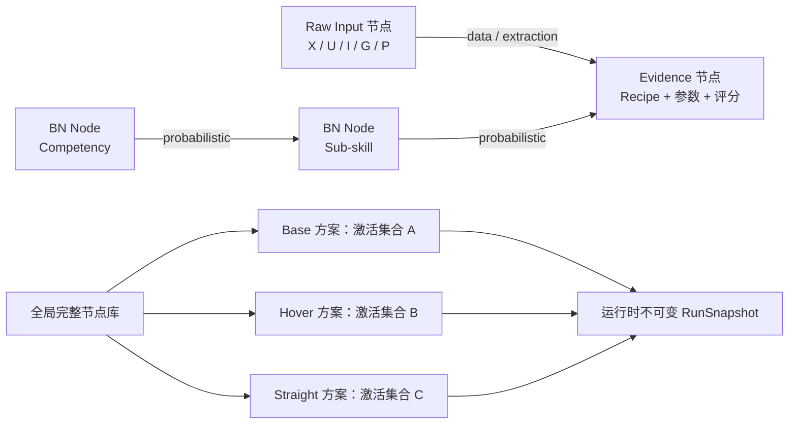

# M7 WinUI Expert Designer and Task Activation Workspace Design

| 字段 | 值 |
|---|---|
| 设计基线 | M7 v0.1 |
| 日期 | 2026-07-17 |
| 状态 | Approved；2026-07-17 用户确认并授权进入 M7 实施规划 |
| 上游实现 | M1–M3、M4R、M5、M6 engineering verified |
| 决策 | D-047–D-053 |
| 下游 | M7A current-model runtime；M7B WinUI expert designer；M8 packaging/handoff |
| 科学状态 | Starter algorithms/thresholds/CPTs 未经领域专家校准，`formal_run_authorized=false` |

## 1. 文档权威与目的

本规格定义 Windows 专家设计器的当前产品语义，以及为该前端补齐的后端模型编辑合同。它是 M7 的权威设计入口，并明确修正 M5/M6 已实现但已不再符合当前产品交互目标的两项旧口径：

1. 不再让专家在同一 concept 下选择多个 task-specific component versions；任务定制使用新的、完整独立节点；
2. 不再要求 Draft → Apply/Publish 才能运行；所有任务方案都是并列、自动保存、可直接运行的当前方案，运行开始时自动冻结不可变 `RunSnapshot`。

M5/M6 的旧 version、draft、publish、exact replay 实现继续作为迁移与历史回放资产，不得删除或伪造为已完成的新语义。M7 实施必须先完成 §17 的后端兼容迁移，再构建依赖新合同的 WinUI 页面。

本规格不证明任一 Evidence、子技能、能力、阈值、CPT 或任务模型科学正确。产品提供的是专家能够设计、运行、比较和持续扩展评估网络的透明工具。

## 2. 一句话产品模型

> 项目内保存一个由 Raw Input、Evidence 和 BN Node 组成的全局节点库；每个任务方案只决定其中哪些完整节点处于激活状态；专家在前端复制、创建或修改节点时直接修改后端 canonical computation definitions；每次运行自动冻结当时的完整网络与参数，因此后续编辑不会改变历史结果。



图中的 BN 箭头表示概率分解，不表示程序只能沿该方向推断。Starter 的 canonical BN 为 `Competency → Sub-skill → Evidence`；实际评估观察 Evidence 后计算能力 posterior。只读 inference overlay 可以显示反向的信息影响，但不得改写 canonical BN edges。

## 3. 核心领域对象

### 3.1 `ModelNode`

画布上的每个圆形节点都是一个完整、独立、只有一个当前功能定义的 `ModelNode`。节点不是“同一 concept 的一个可切换版本槽位”。若两个任务需要不同算法、parents、CPT 或语义，它们就是两个不同节点，即使名称与功能很相似。

示例：

- `Precise`：starter 节点；
- `hover.Precise`：从 `Precise` 复制并为 Hover 修改的新节点；
- `straight.Precise`：为直线保持任务建立的另一个新节点。

三个节点拥有三个稳定 `node_id`，可以并列存在。切换任务方案只改变它们的亮暗和是否参与计算，不会在同一个圆形节点内部替换算法版本。

所有节点共有：

```text
node_id
node_kind                    # raw_input | evidence | bn
name_zh / name_en
short_name_zh / short_name_en
description_zh / description_en
tags / group / lifecycle
copied_from_node_id?
semantic_revision            # optimistic concurrency，不是可选业务版本
content_hash
created_at / updated_at
```

`semantic_revision` 和 change journal 只用于自动保存、并发检查、撤销与审计；它们不得在任务侧边栏中表现成多个可选 task-specific versions。

### 3.2 Raw Input 节点

Raw Input 是 Evidence 的数据来源，不是 BN random variable，也没有 CPT。高层类型包括：

- `X(t)`：飞行状态；
- `U(t)`：控制输入；
- `I(t)`：飞行员在 VR 中实际看到的动态第一视角；
- `G(t)`：gaze、fixation、AOI 与视野关联；
- `P(t)`：生理输入，至少 EEG 与 ECG。

任务 reference、phase/event annotation、扰动区间和 AOI 定义作为与上述流绑定的 typed raw/task resources 展示在 Raw Input 类别内，不新增第四种高层节点。Evidence 的提取依赖只能闭合到 Raw Input；不得依赖另一个已评分 Evidence 或 latent BN posterior。

Raw Input 节点保存 source type、schema ID、adapter/profile、字段与单位、clock binding、session availability 和帮助文本。专家可以选择输入、查看字段、绑定 recipe port，但不能在前端伪造本次 session 实际不存在的采集数据。

### 3.3 Evidence 节点

一个 Evidence 节点必须原子包含：

- bilingual identity 与专业说明；
- fixed raw source bindings；
- 完整 `EvidenceRecipe` operator graph；
- operator parameters、window/aggregation/scoring 定义；
- D/A/U observation mapping；
- BN observation states；
- fixed probabilistic parent IDs 与对应 CPT/CPD；
- provenance、operator/runtime identities 和帮助文本。

这里必须区分两组“parent”：

- **data parents** 是 Raw Input，只决定如何提取 Evidence；
- **probabilistic parents** 是 BN 中该 Evidence 随机变量的父节点，只决定 `P(Evidence | parents)`。

两组关系使用不同字段、edge type、视觉样式和 validator，不能混为一个无类型 `parents` 数组。

### 3.4 BN 节点

一个 BN 节点必须原子包含：

- bilingual identity 与节点类别（如 sub-skill、aggregate competency 或专家自定义类别）；
- state space 与顺序；
- fixed probabilistic parent node IDs；
- CPT/CPD 或受支持的 generator parameters；
- output/reporting metadata；
- 当前 session posterior 的只读展示定义。

如果新任务需要改变 parent set、state space、CPT 或节点语义，专家应复制为新节点后修改；不能让同一 `node_id` 在不同任务中拥有不同 parents。

### 3.5 Edge 不是独立科学事实

高层画布有两类 edge：

| Edge | 来源 | 后端 canonical 存储 |
|---|---|---|
| data/extraction | Raw Input → Evidence | Evidence 的 source bindings / recipe input ports |
| probabilistic | BN/Evidence random variable 的 parent → child | child 节点的 fixed probabilistic parent IDs + CPT/CPD |

新增、删除或反转 edge 本质上是修改目标 child 的完整定义。前端不能只画一条线而不更新 recipe/CPT，后端也不能保存与节点定义分离的幽灵 edge。

## 4. 全局节点库与任务方案

### 4.1 全局节点库

每个受管项目有一个 project-wide 节点库，保存所有 Raw Input descriptors、Evidence 节点和 BN 节点。节点可以被零个、一个或多个任务方案使用。

共享一个节点本身没有错误：只要多个任务需要完全相同的 recipe、parents、states、CPT 和语义，就让它们引用同一 `node_id`。修改共享节点会影响所有引用它的方案的**后续运行**；节点窗口必须显示“被哪些方案使用”，但不强制专家复制或阻止保存。若某个任务需要不同定义，专家自行复制节点后再修改。

### 4.2 `TaskScheme`

每个飞行任务方案是一个并列、可编辑、可直接运行的 `TaskScheme`：

```text
scheme_id
name_zh / name_en
description_zh / description_en
explicit_active_node_ids
computed_active_closure
output_node_ids
task/reference bindings
global layout reference + scheme layout overrides
semantic_revision / layout_revision
technical_status
content_hash
```

`TaskScheme` 不覆盖节点内部算法、parents 或 CPT。它只选择完整节点并组织本任务的激活网络。相似任务需要不同节点时，方案分别激活不同 `node_id`。

### 4.3 左侧任务切换

Model Studio 左侧固定显示可切换方案，例如：

- Base Scheme；
- Hover Scheme；
- Straight Flight Scheme。

点击方案后：

- 当前方案显式选择及其依赖闭包变亮；
- 未参与当前方案、但真实存在于全局库的节点和边变暗；
- 节点内部定义不被替换；
- 当前画布筛选、缩放与布局上下文切换到该方案；
- 后端当前 scheme context 与前端选择一致。

方案数量增加时，侧栏支持搜索、任务标签、分组、归档和排序。

### 4.4 亮暗的功能语义

亮暗不是装饰：

- **亮**：节点在当前方案的 `computed_active_closure` 中，会参与 preflight/run；
- **暗**：节点仍是真实可查看、可复制、可编辑的全局节点，但当前方案不执行它；
- active edge：关系属于 child 的固定定义，且两个端点都在当前 active closure；
- inactive edge：关系真实存在，但至少一个端点未激活。

画布必须提供 `仅激活`、`激活 + 未激活`、`全部全局节点` 三种视图，以及按名称、标签、类型、group 和任务使用情况过滤。系统不能依赖无限缩放来处理大量节点。

## 5. 激活与停用规则

### 5.1 启用 child

专家启用一个节点时，系统不弹确认框，后端在同一原子事务中：

1. 把目标加入 `explicit_active_node_ids`；
2. 递归加入其全部 fixed data parents 与 probabilistic parents；
3. 计算新的 `computed_active_closure`；
4. 点亮闭包内所需 edges；
5. 返回 canonical diff、scheme revision 与 technical status。

父节点因依赖闭包被自动启用，不一定进入 explicit set。专家知道这一行为，不需要额外提示。

### 5.2 停用 parent

若停用的节点仍被当前方案中的 active downstream nodes 依赖，前端必须弹出影响确认窗口，列出递归受影响节点与 edges，并提供：

- `继续停用`；
- `取消`。

继续后，后端在一个事务中级联移除该 parent 及所有受影响 downstream nodes 的 explicit selections，再重算 closure；全部成功或全部不变。其他任务方案不受影响。

### 5.3 停用 child

停用 child 后重算 closure。某个 ancestor 若仍是 explicit selection 或仍被另一个 active child 需要，则继续亮；否则自动变暗。该行为支持 undo/redo。

### 5.4 画布 Delete 键

在任务画布按 Delete 默认表示“从当前方案停用”，不是从全局库物理删除节点。全局节点的归档是 Library 中的独立命令；被方案或历史 RunSnapshot 引用的节点不得物理删除。这样既满足任务编排，也避免一个任务的删除操作破坏其他任务。

## 6. 节点复制与粘贴

### 6.1 默认语义

支持 Ctrl+C/Ctrl+V、右键菜单、多选和同一项目内跨任务粘贴。默认复制行为是：

- 深复制所选节点自身的完整定义；
- 为副本创建新的 `node_id`；
- 保存 `copied_from_node_id` lineage；
- 继续引用原来的 fixed parent node IDs；
- 不复制 parent 节点或整条依赖分支；
- 不修改原节点；
- 不自动让原节点的 downstream children 改用新节点。

“深复制节点自身”意味着 EvidenceRecipe、参数、states、CPT、metadata 和本节点布局都被复制；parent references 保持引用，不产生父节点副本。

### 6.2 粘贴到当前任务

粘贴成功后，新节点加入全局库并在当前方案中显式启用；其 fixed parent closure 自动启用。原节点保持原状态，直到专家主动停用。专家随后可以重命名并修改副本，例如把 `Precise` 改为 `hover.Precise`。

若专家修改副本的 parent set，CPT 必须按 §9 在同一事务中迁移或重建。它从此是另一个完整节点。

### 6.3 复制任务方案

`复制方案` 会立即创建新的并列 `TaskScheme`，复制：

- explicit active selections；
- output nodes 与 task/reference bindings；
- scheme layout overrides、filters 和分组；
- bilingual description 与 lineage。

新方案立即出现在左侧列表，可切换、编辑和运行；不需要发布或审批。全局节点本身默认共享，不批量复制。专家只对需要定制的节点逐个复制。

## 7. Model Studio 画布

### 7.1 节点视觉

节点通常为圆形：

- Raw Input：青绿色；
- Evidence：琥珀/橙色；
- BN sub-skill：紫色；
- aggregate competency：更大、深蓝紫色、双环；
- inactive：保留类型色相但降低不透明度和边框强度；
- incomplete/error：使用非颜色唯一的图标、边框与文本状态。

圆内显示清晰短名称，允许 2–3 行；完整名称通过 tooltip 与节点窗口显示。切换 `中文 | EN` 后名称同步切换，不改变 ID 或计算。

### 7.2 基本操作

画布支持平移、滚轮缩放、适应视图、框选、多选、拖拽布局、创建节点、连接、删除/停用、copy/paste、undo/redo、搜索和小地图。拖动位置只更新 layout revision，不改变 semantic hash。

### 7.3 两种边与 inference overlay

data/extraction edge 与 probabilistic edge 使用不同颜色、线型、箭头和图例。Inference overlay 是只读第三种显示层，用于展示 observation 对 posterior 的影响；它不能被编辑、复制成 canonical edge 或进入节点 parent definition。

## 8. 多节点独立浮动窗口

点击节点打开可自由移动、缩放、最大化的非模态独立窗口，而不是固定右侧 Inspector。必须允许同时打开多个节点窗口，在双屏环境并排比较和编辑。

窗口规则：

- 同一 `(project_id, scheme_id, node_id)` 默认只开一个窗口并聚焦现有实例；
- 不同节点或同一共享节点的不同 task context 可同时打开；它们编辑同一 canonical node 时都必须显示最新 revision/conflict；
- 节点窗口可以跨屏移动，并记住位置、尺寸和最大化状态；
- 主画布在窗口打开时保持可操作；
- 标题区显示节点名、类型、当前 task context、共享方案数量和保存状态；
- 若另一个窗口或操作修改同一节点，使用 revision conflict/reload，而不是静默覆盖。

Evidence 窗口至少包含：

- General；
- Raw Input bindings；
- 完整 EvidenceRecipe/operator graph；
- Parameters；
- Aggregation/Scoring/D-A-U；
- BN observation states、probabilistic parents 与 CPT；
- 当前 session Preview/Trace；
- Used by schemes；
- Change history。

BN 窗口至少包含：

- General；
- fixed probabilistic parents/children；
- states；
- CPT/generator；
- 当前 posterior/influence；
- Used by schemes；
- Change history。

CPT 可以最大化为整窗表格，但仍属于该节点窗口，不另存第二份前端状态。

## 9. Parent、Edge 与 CPT 原子一致性

child 节点、fixed probabilistic parent set、state order 与 CPT/CPD 是不可分割的完整定义。以下动作必须是单个后端事务：

- 新增 parent edge + CPT 扩维/初始化；
- 删除 parent edge + CPT 边缘化或专家选择的重建；
- 修改 parent order + CPT axis reorder；
- 修改 node/parent states + CPT 迁移或明确置为 incomplete；
- 批量粘贴 CPT + shape、row-sum 和 finite-number validation。

前端可提供 uniform、independent-copy、ranked/default generator、normalize 和手工编辑，但不能自行计算一套 CPT 再假定后端接受。后端返回的 canonical node definition、migration report、revision 和 hash 是唯一成功结果。

CPT 编辑器支持键盘导航、区域复制粘贴、批量填充、row validation、normalize、diff、undo/redo 和当前 session 推理预览。科学上“不合理”只提示，不阻止保存；结构上无法执行的配置可自动保存为 `configuration_incomplete`，但不能开始 run。

## 10. 自动保存；取消 Draft/Published

### 10.1 当前交互

所有任务方案是并列、自动保存、可自由编辑的当前对象。正常 UI 不提供：

- Draft / Published 两套列表；
- Apply / Publish 按钮；
- “只有发布版本才能运行”的门；
- 同一圆形节点的 task-specific version picker。

用户可见保存状态只有：

- `正在保存`；
- `已保存`；
- `保存失败`；
- `配置未完成`。

每个用户意图作为幂等、带 expected revision 的原子 operation 自动保存。允许 incomplete 配置继续编辑；运行时 preflight 才要求所选 active closure 技术可执行。该 preflight 不是科学审批或发布流程。

### 10.2 Change journal

后端保留 append-only change journal、undo/redo cursor、actor/time、before/after hashes 和 transaction receipt。它用于恢复、冲突处理和审计，不作为任务侧边栏中的并行模型版本。专家可以查看历史或撤销，但不需要先“发布”当前状态。

### 10.3 运行时不可变快照

`run.start(scheme_id, session_revision_id, expected_scheme_revision)` 在同一事务边界先冻结 `RunSnapshot`，再创建运行。快照至少包含：

- exact managed session revision/root hash；
- scheme ID、explicit selections、computed active closure、outputs 与 task bindings；
- active Raw Input descriptors；
- 每个 active Evidence/BN 节点的完整 canonical definition 与 content hash；
- 两类 fixed edges；
- EvidenceRecipe、operator、scorer、runtime identities 与 hashes；
- states、CPT/CPD、runtime parameters；
- technical/scientific status 与 snapshot hash。

运行开始后的节点或方案编辑只影响未来运行。历史结果始终引用其 `RunSnapshot`，不依赖当前节点状态，也不要求保留一个可编辑的“旧任务版本”。

## 11. 前端与后端一一映射

前端是专家操作入口，后端 persisted objects 是 canonical state，二者不是两套模型。所有可编辑 UI 控件必须调用 typed backend operations；成功后以 backend response 重绘，失败时回滚 pending UI 并显示稳定错误。

这不表示前端修改 `.py` 文件。通用 Python engine 执行后端保存的 EvidenceRecipe、parameters、parent sets 和 CPT；这些声明就是专家可修改的计算定义。只有现有 operator library 无法表达的新计算能力，才需要开发并安装 trusted Python operator。普通新增/复制 Evidence、修改参数、公式、连接、states 或 CPT 都不需要发布 Python plugin。

禁止：

- 在 C# 中复制 Evidence/BN 计算逻辑；
- 前端本地保存未提交的“真模型”并绕过后端；
- 把任意用户输入 Python/eval 当作 operator 执行；
- 图形 edge、表格 CPT 与后端 child definition 不一致。

## 12. M7 页面与信息架构

应用外壳使用 WinUI 3，本地前端隐藏启动 M6 stdio sidecar，不监听网络端口。顶部持续显示 project、session、task scheme、backend health、autosave state、technical status、语言和 Run。

左侧一级导航：

- Projects；
- Sessions；
- Model Studio；
- Runs；
- Results；
- Library；
- Diagnostics。

核心页面：

1. **Project Launcher**：创建/打开/最近项目；没有最近项目时为默认入口；
2. **Session Import**：inspect、复制到受管项目、readiness 与 import progress；
3. **Session Explorer**：同步查看 VR scene、gaze/AOI、pilot camera、X/U、EEG、ECG、events/reference；
4. **Model Studio**：任务侧栏、全局节点画布、激活/停用、copy/paste、节点浮动窗口；
5. **Run**：选择 managed session 与当前 scheme，preflight、start、progress、cancel；
6. **Results**：competency/sub-skill posterior、Evidence observation、时间窗、trace、artifact 和 snapshot drill-down；
7. **Library**：全局节点搜索、使用情况、归档、operator catalog；
8. **Diagnostics**：sidecar stderr、stable error code、project recovery 和 support bundle。

打开应用时：有上次成功打开的项目则恢复该项目与最后使用的任务方案；否则进入 Project Launcher。用户 session 数据始终在受管项目中，不随软件安装包分发。

## 13. 中英文

顶部提供 `中文 | EN`，无需重启即可切换：

- WinUI 系统文本、菜单、错误和帮助使用资源文件；
- 每个 ModelNode 和 TaskScheme 在后端保存 bilingual name/description/optional short name；
- 某语言缺失时回退到另一语言，并显示 non-blocking “translation missing”；
- ID、hash、operator key、schema field、run snapshot 和计算结果不随语言变化。

## 14. M7 所需后端/RPC 表面

M7 不得只包装旧 Draft/Publish API。实施时至少提供下列 current-object operations（最终 method names 由实施计划冻结）：

| 范围 | 能力 |
|---|---|
| Node | list/get/create/copy/update/archive、usage list、history、undo/redo |
| Scheme | list/get/create/copy/update metadata、activate/deactivate、closure/diff、layout |
| Graph | scoped snapshot、filters、typed edge add/remove、batch operation |
| CPT | validate/materialize/migrate/update cells |
| Preview | current node/recipe trace、current scheme posterior，不要求 publish |
| Run | preflight/start from current scheme revision、automatic immutable snapshot |
| Localization | bilingual model metadata read/write |

每个 mutation 继续使用 M6 的 `transaction_id`、idempotency receipt、expected semantic/layout revision、audit event 和 stable error code。stdout 仍只传 JSON-RPC JSONL；视频、图像与长时序只传 managed artifact/session IDs。

## 15. 错误与恢复

- sidecar 未启动：应用自动重启一次，仍失败则显示 Diagnostics 与日志路径；
- autosave response 丢失：使用相同 transaction ID 幂等重试；
- revision conflict：保留用户 pending value，拉取 canonical diff，让用户 reload 或重新提交；
- configuration incomplete：允许继续编辑，精确高亮缺少的 binding/parent/CPT/operator；
- operator unavailable：节点仍可保存但不能 preview/run，不伪装成 session 数据缺失；
- deactivation cascade failure：整批回滚；
- run 中 sidecar crash：沿用 M6 `interrupted`，历史 RunSnapshot 不变；
- shared node 编辑：所有引用方案重新计算 technical status，UI 显示影响列表，不自动复制、不静默分叉。

## 16. 非目标

M7 不负责：

- 证明 starter Evidence、Hover BN、阈值或 CPT 科学有效；
- 自动从数据学习 Evidence 算法、BN topology 或 CPT；
- 为专家每次参数修改运行 pytest/golden 或人工审批；
- 在前端执行任意 Python；
- 打包 installer、自动更新、云同步或跨项目 merge（属于 M8/未来版本）；
- 把测试用 synthetic visual/gaze/EEG/ECG generator 做成产品入口；
- 把用户 session 数据打进应用发布包。

## 17. 从已实现 M5/M6 的迁移边界

当前代码已经工程验证的是 M5/M6 的 immutable component versions、scheme draft/publish 和 published-scheme run lock。它们不能被文档更新冒充为已完成的新语义。M7 实施计划必须先完成：

1. 新增 current `ModelNode` 与 mutable `TaskScheme` canonical contracts/persistence；
2. 用 internal revision/change journal 保留 optimistic concurrency、undo/redo 和 audit，但不暴露 task-specific version picker；
3. 把 Hover starter materialize 为一组完整节点与 Base Scheme activation set；
4. 对旧同-concept parallel versions：若定义不同，则迁移为不同 `node_id`；若只是历史 revision，则只保留在 replay/archive 层；
5. 扩展 M6 sidecar，允许 current-object autosave、scheme copy、activation closure 和 run-from-current-scheme；
6. 泛化 `RunSnapshot`：锁定 current scheme/node definitions，而不是要求输入必须是 published scheme；
7. 保持所有旧 run、旧 published scheme 和 content hashes 可读、可回放；
8. 将旧 `scheme.draft.*` / `scheme.*.publish` 标为 compatibility/migration API，M7 正常 UI 不调用；
9. 完成后再构建 WinUI shell、Model Studio、floating editors、Run/Results。

这是一项后端模型编辑语义迁移，不推翻 M1–M4R 的数据合同、EvidenceRecipe/operator executor、M5 的 BN inference 或 M6 的 managed project/session/artifact/stdio 基础设施。

## 18. 验收标准

书面规格进入实施计划前必须确认：

1. 每个可见 Evidence/BN 节点只有一个当前完整定义；不同 task-specific 定义使用不同 node IDs；
2. 同一节点可被多个任务共享，且 parent set 在所有任务中相同；
3. 任务侧栏切换只改变 active/dim 和执行集合，不替换节点内部版本；
4. 启用 child 自动递归启用 parents；停用有 active downstream 的 parent 必须提供继续/取消的 cascade dialog；
5. 默认 copy/paste 只复制所选完整节点，引用原 fixed parents；
6. 复制方案立即产生并列可编辑方案；
7. 所有编辑自动保存，无 Draft/Published/Apply/Publish 正常流程；
8. 每次 run 自动冻结 exact immutable snapshot，历史结果不随后续编辑变化；
9. 修改 parents/edges/states/CPT 为同一原子 backend operation；
10. 多个可移动、缩放、最大化的节点窗口可同时编辑；
11. 中英文切换不改变任何模型 identity 或计算；
12. 前端修改真实落到后端 canonical definitions，C# 不复制算法；
13. 只有新增 operator 能力需要 Python plugin；普通节点/参数/CPT/recipe 修改不需要；
14. M7 状态必须明确为“设计中/未实现”，直到代码与轻量工程验收完成。

## 19. 已批准实施路径

2026-07-17 用户确认本规格并要求持续推进。M7 已按 `writing-plans` 工作流拆为以下连续、INLINE、轻量平台验证计划：

1. [M7 Implementation Roadmap](../plans/2026-07-17-m7-winui-expert-designer-implementation-roadmap.md)：冻结总顺序、跨阶段门槛与验证边界；
2. [M7A Current Model Runtime Implementation Plan](../plans/2026-07-17-m7a-current-model-runtime-implementation-plan.md)：先实现 §17 的 current complete-node/task-activation backend compatibility、persistence、sidecar 与 automatic RunSnapshot；
3. [M7B WinUI Expert Designer Implementation Plan](../plans/2026-07-17-m7b-winui-expert-designer-implementation-plan.md)：再实现 .NET sidecar client、WinUI shell、Model Studio、floating node windows、Run/Results 与 bilingual polish。

计划保持现有项目的 INLINE 执行策略，不使用大量 subagents；只验证平台不变量和轻量纵向闭环，不扩展 starter 科学 goldens。M8 packaging 仍必须等待 M7 可见 Windows 应用完成验收。
