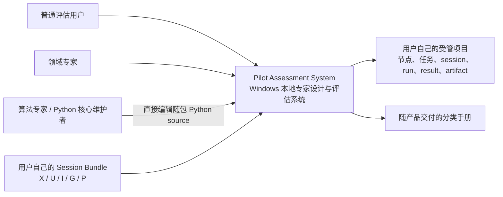
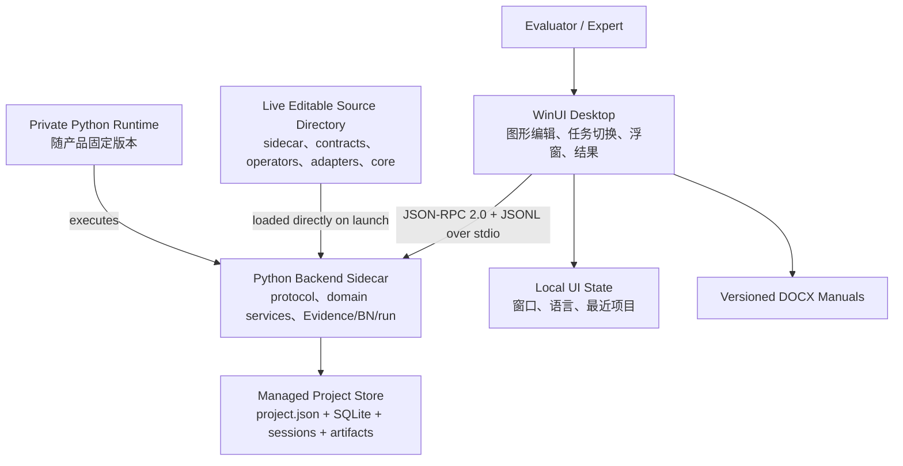

# M8 Productization, Editable Python Source, Documentation and Handoff Design Outline

| 字段 | 值 |
|---|---|
| 设计基线 | M8 pre-UAT outline v0.2 |
| 日期 | 2026-07-18 |
| 状态 | **路线图已批准；M8A 已于 2026-07-20 获准执行；M8B–M8E 仍需各自正式计划** |
| 上游状态 | M7 工程完成门已通过；用户手工验收与可能返修尚未完成 |
| 目标平台 | Windows x64、本地离线、解压即用的便携交付方向 |
| 科学状态 | Starter algorithms、thresholds、BN topology 与 CPT 未经领域专家校准；`formal_run_authorized=false` |
| 当前执行入口 | [M8A Portable Windows Release Design](2026-07-20-m8a-portable-windows-release-design.md) |

## 1. 文档地位

本文件最初用于在 M7 用户验收之前描述 M8 的完整路线。2026-07-20，用户明确要求开始执行既定 M8 计划和打包整个项目，因此路线图获得批准，并由新的正式规格启动 M8A。本文仍不是逐文件实施计划；具体执行以各 M8 子阶段的正式规格和计划为准。

M7 用户验收可能改变窗口布局、操作路径、字段暴露方式、错误恢复和帮助入口。为了避免在尚未稳定的界面上提前冻结打包、截图、手册和源码交付合同，本文件遵循以下规则：

1. M7 现有代码和工程测试结果保持不变；
2. M7 状态写为“engineering verified，user acceptance pending”；
3. 用户已明确授权在保留 M7 人工验收状态的前提下先执行 M8A 工程打包；
4. 已由 M8A 正式规格采用的候选项写入 `DECISIONS.md`，其余候选项仍不自动生效；
5. M8B–M8E 继续分别收口正式计划；M7 用户验收仍须在 M8E 最终交付候选前关闭。

如果本文件与已批准的 D-031–D-053 或 M7 规格冲突，以已批准决策和 M7 规格为准。只有后续经用户确认的 M8 正式规格才能改变这一优先级。

## 2. M8 的产品目标

M8 的目标不是重新设计飞行员能力评价算法，而是把已经完成的专家设计与运行平台变成可迁移、可扩展、可理解、可恢复的 Windows 产品交付物。

完成后的目标体验是：

1. 用户下载一个 Windows x64 交付包并解压；
2. 无需预装 Visual Studio、.NET SDK、系统 Python 或项目源码依赖即可启动；
3. 软件自动启动随产品提供的本地 Python sidecar，不监听网络端口；
4. 用户创建或打开自己的受管项目，再导入 canonical Session Bundle 或模拟器 `streams/`/`annotations/` raw source；
5. 专家继续通过前端创建、复制、修改 Evidence、BN 节点、任务方案、参数、父节点和 CPT；
6. 已有 operators 能表达的变化不要求修改 Python；
7. 确实需要全新 Evidence 计算能力或修改 backend core 时，专家可以直接编辑发布目录中正在运行的第一方 Python 源码；关闭并重启软件后，修改对该软件副本的全部项目和后续运行生效；
8. 项目可备份、恢复并迁移到另一台 Windows 设备；
9. 用户、专家和开发维护者均能从分类文档中找到与自己任务对应的说明；
10. 发布验收只证明软件交付与工程工作流，不宣称 starter 模型科学有效。

## 3. 明确不属于 M8 的内容

M8 不包含：

- 由航空、训练、生理或人因专家完成的 Evidence、threshold、CPT 或能力模型科学校准；
- 用真实受试者样本证明效度、信度、敏感性或泛化能力；
- 适航、医疗、执照、训练认证或实时机载用途认证；
- 云服务、多人协同、在线账户、远程数据库或网络 API；
- 自动更新、应用商店、插件市场或在线扩展下载；
- 把任何用户 session、项目、结果或身份数据打进通用产品包；
- 内置 Python 源码编辑器、前端代码执行 API、远程 shell 或项目级 backend source overlay；专家直接使用任意本地文本编辑器或 IDE 修改发布目录中的源码；
- 把第一方 Python backend 编译成不可读、不可改或只存在于 wheel/zipimport 中的隐藏实现；
- 为每一次参数编辑运行重型科研数据集或重新证明 starter 算法；
- 在本文件最初的候选大纲阶段直接实施 M8 代码。该历史限制已由 2026-07-20 用户授权和 M8A 正式规格取代；后续实现仍须进入相应正式计划。

新的 BN 推理家族、连续变量 CPD、动态贝叶斯网络、数据采集设备驱动和新的 Session adapter 实现不默认由本项目预先开发；但发布包会暴露相应第一方 Python 模块、contracts、registries 和构建元数据，具备 Python 能力的专家可以直接修改或增加实现。M8 负责保证源码可见、运行入口清楚、修改方法有文档，而不替专家编写所有未来算法。

## 4. Gate 0：M7 用户验收与返修收口

M7 用户验收仍是 **M8E 最终交付候选** 的硬前置条件，工程自动化不能替代该门槛。用户于 2026-07-20 明确授权 M8A 便携工程包先行，因此 M8A 不再受此顺序限制；该例外不自动授权跳过 M8B–M8E 的正式范围和验收。

### 4.1 用户验收应覆盖的真实操作

用户至少应亲自确认：

1. 启动软件，创建或打开受管项目；
2. 分别导入一个 canonical Session Bundle 和一个轻量 simulator raw source，并查看 X/U/I/G/P 可用状态；raw source 未声明单位时不得要求用户补填；
3. 在左侧切换、创建、复制、重命名和归档任务方案；
4. 在全局图中缩放、平移、筛选、拖动节点并观察 active/dim 状态；
5. 同时打开多个可移动、可缩放的独立节点窗口；
6. 修改 Evidence 参数和 recipe 字段，关闭时选择“保存全部”，重开后确认 canonical 状态更新；
7. 修改 BN states、parents 和 CPT，验证先进入后端持久草稿，保存全部后再同步 canonical 状态；
8. 复制节点后继续引用原父节点，并在新任务中启用副本；
9. 启用 child 时自动启用 parent closure；停用被依赖 parent 时检查 Continue/Cancel；
10. 从当前任务方案执行 preflight/run，查看 Evidence、posterior、trace 和 diagnostics；
11. 重启应用后重新打开同一项目和历史结果；
12. 中英文切换、键盘操作、窗口布局和错误提示符合实际使用预期。

### 4.2 反馈分类

M7 验收发现按以下方式处理：

| 类型 | 处理方式 |
|---|---|
| 阻碍现有设计/运行主流程 | 作为 M7 返修，完成后重新执行相关轻量工程门 |
| 字段、布局、术语或帮助入口不清晰 | 优先作为 M7 UX 返修；同时更新未来截图与手册大纲 |
| 仅与便携运行、源码交付/修改、依赖管理、备份或交付有关 | 进入 M8 正式规格 |
| 与模型科学合理性有关 | 记录为专家校准事项，不阻塞 M8 软件产品化 |
| 新的产品能力或架构方向 | 单独讨论，不自动扩大 M8 |

### 4.3 Gate 0 关闭条件

只有同时满足以下条件才开始编写可执行 M8 子计划：

- 用户明确表示 M7 手工验收完成；
- 已确认的 M7 缺陷和必要返修已经关闭；
- M7 关键界面、字段、协议和项目格式不再处于本轮变动中；
- 本 M8 候选大纲已按最终 M7 行为复核；
- M8 候选决策经用户确认并正式写入 `DECISIONS.md`。

## 5. 角色与核心使用场景

| 角色 | M8 主要目标 |
|---|---|
| 普通评估用户 | 解压启动、导入自己的 session、选择任务方案、运行、查看与导出结果 |
| 领域专家 | 修改/新增 Evidence 和 BN 节点、任务方案、参数、parents、states 与 CPT |
| 领域算法专家/扩展开发者 | 在现有 operator 无法表达新计算时，直接修改当前系统的 Python operator/core 源码并重启验证 |
| Python 核心维护者 | 维护 contracts、runtime、persistence、execution、migration、registries 与依赖 |
| C# 前端维护者 | 维护 WinUI presentation、typed intent、sidecar lifecycle 和用户交互 |
| 发布维护者 | 构建、校验、签出便携包，维护第三方清单、版本和发布证据 |
| 项目接手者 | 依据总册理解系统、恢复开发环境、诊断问题并继续演进 |

M8 必须使每一类角色只阅读与自身任务有关的入口，同时保留一份完整技术参考用于系统级理解。

## 6. 轻量 C4 架构表达

M8 文档只借用 C4 的层级和受众意识，不把项目改造成另一套架构方法。根据 C4 官方说明，多数团队使用 system context 和 container 两层已经足够；component 图只在 editable Python source、发布构建或故障诊断确有价值时添加。

### 6.1 System context



边界说明：

- 通用产品包只包含系统、运行时、starter 资源和文档；
- Session Bundle、受管项目和运行结果由每位用户自行提供或产生；
- 产品不依赖云端服务；
- 第一方 Python 源码随系统完整暴露并由该软件副本直接运行；源码修改不是普通模型参数修改，而是对整套 backend 实现的全局修改。

### 6.2 Container view



责任边界保持不变：

- WinUI 负责展示、交互、typed intent 和本地窗口偏好；
- Python domain services 负责 edit-session state、canonical state、持久化、Evidence/BN/CPT/run 计算；
- “Python 负责计算”不等于 Python 固定科学内容。专家通过前端修改 staged recipe、参数、parents 和 CPT，明确保存全部后成为 canonical 定义；Python 只按当前 clean canonical 定义执行；
- 发布目录中的第一方 Python 源码就是 sidecar 实际导入和执行的源码，不另藏一份优先级更高的 wheel implementation；
- 专家直接修改源码时不经过 WinUI。修改对当前软件副本全局生效，未来 run 使用新源码，已有结果记录保持不变；
- 协议层不复制算法；stdout 只承载协议消息，日志进入 stderr；
- 大型图像、视频和时序数据只以受管路径、session ID 或 artifact ID 引用，不进入 JSON 消息。

## 7. 候选便携交付模型

### 7.1 分发形态

首个 M8 交付候选为：

- Windows x64；
- unpackaged、自包含目录；
- ZIP 下载后解压运行；
- .NET 与 Windows App SDK 采用自包含发布能力；
- Python Core 使用随产品提供的隔离私有运行时；
- 第一方 Python backend 以普通 `.py` 源码目录交付，sidecar 直接从该目录运行；
- `pyproject.toml`、依赖锁、schemas、starter resources 和必要构建工具同样可见；
- 不要求管理员安装系统 Python、.NET SDK 或 Visual Studio；
- 不在首个 M8 中引入安装器、MSIX、自动更新或单文件打包。

精确的 .NET SDK、Windows App SDK、Python、第三方 wheel 和文档工具版本只在 Gate 0 关闭后通过 release toolchain lock 冻结。本大纲不提前锁定可能因 M7 返修而变化的版本。

### 7.2 候选目录

```text
PilotAssessment/
  PilotAssessment.Desktop.exe
  app/                         # WinUI/.NET/Windows App SDK 自包含文件
  runtime/
    python/                    # 隔离私有 Python runtime
    site-packages/             # 锁定的第三方依赖
  backend/
    src/
      pilot_assessment/        # sidecar 实际运行的完整、可编辑第一方 Python 源码
    pyproject.toml             # backend package/dependency metadata
    uv.lock                    # release dependency lock
    README-DEVELOPMENT.md      # 源码修改入口和影响范围
  resources/
    starter/                   # 可编辑 starter 模板
    schemas/                   # 跨语言 contracts
  docs/
    zh-CN/                     # 版本化 DOCX
    en-GB/                     # 版本化 DOCX
  developer/
    desktop-source/            # C#/WinUI 源码；修改后需要重新构建
    build/                     # release/source build scripts
    tools/                     # 固定版本的 Python 依赖管理/开发工具
  licenses/
  manifest/
    release-manifest.json
    source-baseline.json       # 官方第一方源码文件与初始 hashes
    checksums.sha256
    sbom.spdx.json
  README.txt
```

最终目录可在 M8A 正式规格中调整，但必须保持以下不变量：

1. 应用从自身安装/解压根定位私有运行时，不依赖开发仓库；
2. `backend/src/pilot_assessment/` 是唯一活动的第一方 Python backend tree；运行时不得优先导入另一份隐藏 wheel/source copy；
3. 发布包建议解压到普通用户可写目录，使专家可以直接保存 `.py`、JSON 和配置修改；
4. 开发工具缓存、`.venv`、测试输出、用户绝对路径和临时文件不进入包；
5. 用户项目默认由用户选择位置，不能写入应用目录；
6. UI 偏好可以位于 `%LOCALAPPDATA%\PilotAssessmentSystem`，但 Python core 不创建 project-specific source overlay；
7. 产品升级不能删除、覆盖或自动合并用户已经修改的旧软件目录；新版本采用新的并列解压目录；
8. 发布清单记录官方源码 baseline hashes；源码被修改后显示 `locally_modified`，但不得仅因偏离 baseline 而阻止启动或运行。

### 7.3 用户数据与产品包分离

以下内容严禁进入通用发布包：

- 用户导入的 X/U/I/G/EEG/ECG/pilot-camera 数据；
- 受试者身份、同意、隐私映射或真实研究数据；
- 用户项目数据库、任务定制、运行结果和 artifacts；
- 本机最近项目、窗口位置和日志；
- repository-external 格式样例及为软件测试生成的合成多模态数据。

允许随产品提供的只有明确标注为 synthetic/engineering-only 的最小无身份演示资源，并且是否包含该资源需在 M8 正式规格中单独确认。默认方向是不附带用户测试数据。

## 8. 可直接编辑的后端 Python 源码

### 8.1 两种修改层级

系统明确提供两条并行路径：

| 修改目标 | 推荐入口 | 是否需要改 Python |
|---|---|---|
| Evidence/BN/task 的参数、recipe 组合、parents、states、CPT、激活关系 | WinUI 结构化编辑器 | 否 |
| 新 operator、修改 operator 实现、adapter、BN engine、sidecar、persistence 或其他 backend core 行为 | 直接编辑 `backend/src/pilot_assessment/` | 是 |

前端结构化编辑继续服务不需要编程的专家。直接源码编辑是具备 Python 能力的专家和维护者使用的最高自由度入口；二者互不排斥。

### 8.2 单一系统、全局生效

每个解压出来的 `PilotAssessment/` 目录是一套完整系统，并且只有一棵活动 backend source tree：

```text
PilotAssessment/backend/src/pilot_assessment/
```

专家修改这里的 Python 源码后：

- 关闭并重新启动软件/sidecar 后生效；
- 修改对这个软件副本打开的所有项目、所有任务方案和所有未来 run 生效；
- 不生成项目级源码副本，不在不同项目之间切换 backend core；
- 若需要保留另一套完全不同的 backend core，直接复制或重新解压整套 `PilotAssessment/` 目录；
- 已经保存的历史结果不被重算或覆盖；未来运行使用修改后的实现。

### 8.3 必须完整暴露的第一方内容

发布包不得隐藏、混淆或只交付编译后的第一方 Python backend。至少暴露：

- `backend/src/pilot_assessment/evidence/builtins/`：已有 operator definitions 和 implementations；
- `backend/src/pilot_assessment/evidence/registry.py` 与 `evidence/builtins/__init__.py`：operator registry 和 `register_builtin_operators()`；
- `backend/src/pilot_assessment/evidence/compiler.py`、`executor.py`、`validation.py`：recipe 编译、执行和技术校验；
- `backend/src/pilot_assessment/bayesian/`：BN validation、factor 和 inference；
- `backend/src/pilot_assessment/ingestion/adapters/`：Session adapter；
- `backend/src/pilot_assessment/contracts/` 与公开 schemas：跨模块数据合同；
- `backend/src/pilot_assessment/runtime/`、`persistence/`、`sidecar/`：应用组合、存储和协议；
- starter recipes/resources、`pyproject.toml`、依赖锁和构建脚本；
- C#/WinUI source archive 与重建文档。C# 不是解释执行，修改后必须重新构建；这一点必须与 Python 的“重启即生效”区分。

第三方依赖可以继续以安装包形式存在于私有 runtime，但必须提供名称、版本、许可证和来源；“所有内容暴露”主要指本项目拥有和维护的第一方实现及其配置。

### 8.4 标准源码修改流程

正式文档必须按真实发布目录给出以下步骤：

1. 关闭 Pilot Assessment System，确保 sidecar 退出；
2. 在修改前复制整个软件目录，或保留原始发布 ZIP 作为干净基线；
3. 用任意文本编辑器或 IDE 打开 `backend/src/pilot_assessment/`；
4. 修改目标 `.py`、JSON resource、schema 或依赖 metadata；
5. 若只使用现有依赖，重新启动软件即可；
6. 若新增第三方依赖，使用随包固定的私有 Python/依赖管理工具更新当前软件目录的 runtime 和 lock；
7. 查看启动 diagnostics；若 import、syntax 或 contract 错误，直接修复文件后再次启动；
8. 使用一个小 session 和目标 Evidence/BN 路径做轻量检查；该检查是修改者的开发验证，不是每次保存的强制审批；
9. future run 自动记录当前 backend source identity。

产品不提供源码修改审批、发布按钮或强制 per-edit tests。Python 语法/import 错误可能导致 sidecar 无法启动，这是直接修改核心代码的自然结果；系统只需要把错误完整显示出来，不应静默回退到隐藏旧实现。

### 8.5 新增 operator 的文档路径

新增一种 Evidence 计算机制时，手册必须以当前真实代码结构说明：

1. 在 `backend/src/pilot_assessment/evidence/builtins/` 中选择合适模块或新建聚焦模块；
2. 实现 operator callable；
3. 创建与实现一一对应的 `OperatorDefinition`，写清 inputs、outputs、parameter schema、UI hints、pseudocode 和 implementation identity；
4. 在 `evidence/builtins/__init__.py` 的 `register_builtin_operators()` 中注册 definition/implementation；
5. 若参数需要结构化表单，确保 `parameter_schema` 足以让现有 WinUI 自动生成控件；
6. 重启软件；新 operator 应出现在 catalog 中；
7. 在前端创建或复制一个 Evidence 节点，使用该 operator 组成 recipe；
8. 用轻量 preview/run 检查新 Evidence 是否形成；
9. 若 operator 是实验性的，专家可用清晰 ID/name 与现有 operator 并列，而不必覆盖旧 operator。

这条路径不要求 `.paext`、Extension Manager 或动态 plugin loader。

### 8.6 修改已有 core 的影响说明

文档必须分别解释：

- 修改 existing operator：所有未来使用该 operator identity 的 recipe 都执行新逻辑；
- 修改 `OperatorDefinition`：可能改变前端参数表单和 recipe technical validation；
- 修改 adapter：影响之后导入或读取相应数据 profile；
- 修改 BN inference：影响之后所有使用该 engine 的 posterior；
- 修改 contract/schema：通常还需要同步 Python DTO、JSON Schema 和 C# typed contract，再重新构建 C#；
- 修改 sidecar protocol：通常还需要同步 C# client；
- 修改 starter resource：影响之后从该 starter 创建或加载的内容，不能改写历史 RunSnapshot。

### 8.7 源码身份与历史运行

高自由度不能让运行来源变得不可知。系统只做自动、无审批的 provenance：

1. 发布包提供官方 `source-baseline.json`；
2. 启动和 run preflight 计算当前第一方 backend source tree hash；
3. 与 baseline 不同时标记 `locally_modified=true`，但不阻止运行；
4. 每个 RunSnapshot 记录当前 source hash、Python/runtime/dependency identities 和 modified-file summary；
5. 每个不同 source hash 首次运行时，把该次第一方 Python source snapshot 作为 content-addressed project artifact 保存，后续相同 hash 复用；
6. 历史结果继续指向当时 source snapshot；当前 active system 仍只有一棵源码树。

该机制无需专家提交版本、写说明或通过审核。它只保证将来能够回答“这次结果由哪一份代码产生”。

### 8.8 恢复和升级

- 修改失败时，专家可从原始 ZIP 重新解压，或从修改前复制的系统目录恢复；
- M8 不需要内置 Restore Source 按钮；
- 新产品版本解压到新的并列目录，不自动覆盖已修改旧目录；
- 文档说明如何比较并手工迁移自定义 Python changes；
- 后续若需要在多台系统之间分发源码改动，可以另行设计 patch/plugin package，但它不是首个 M8 的完成条件。

## 9. 分类文档系统

### 9.1 原稿与交付格式

- Markdown 是唯一可维护原稿；
- DOCX 是面向用户和交付的生成物；
- 图表、截图、交叉引用、术语和版本元数据来自受控资源；
- 中文与英文使用独立输出，不在同一段落混排；
- 总册从模块化原稿组合生成，不复制维护另一份内容；
- 每次发布生成带产品版本号、文档版本号、目录和变更记录的 DOCX；
- 文档构建工具版本在 release toolchain lock 中固定。

### 9.2 轻量参考的规范和方法

本项目只吸收以下有用原则，不宣称通过认证或完全符合标准：

1. [ISO/IEC/IEEE 26514:2022](https://www.iso.org/standard/77451.html)：从目标用户与任务出发设计软件用户信息的结构、内容和格式；
2. [ISO/IEC/IEEE 42010:2022](https://www.iso.org/standard/74393.html)：在架构描述中明确关注者、关注点、视图和关系；
3. [Diátaxis](https://diataxis.fr/)：区分 tutorial、how-to、reference 和 explanation，避免把学习路径、实际任务、字段定义和原理讨论混成一章；
4. [C4 model](https://c4model.com/diagrams)：使用 context/container 为主、按需要增加 component 的分层架构图，保持元素、关系和技术边界清晰。

项目内容、实际 UI、真实 contracts 和用户任务始终优先。不会为了“形式符合”而增加无用途章节、重复图或不必要审批。

### 9.3 每份文档的共同元数据

每个 Markdown 原稿与生成 DOCX 至少包含：

| 字段 | 说明 |
|---|---|
| 文档标题和 document ID | 稳定身份，不依赖文件名猜测 |
| 产品版本和文档版本 | 说明适用的软件与文档版本 |
| 状态 | draft / review / released / superseded |
| 目标读者 | evaluator / expert / developer / maintainer / release |
| 内容类型 | tutorial / how-to / reference / explanation 或明确组合 |
| 适用范围与前置条件 | 开始前需要什么、本文不覆盖什么 |
| 科学状态 | engineering-only、expert-reviewed 或 calibrated；不得省略 |
| 相关文档 | 稳定交叉引用 |
| 变更记录 | 版本、日期、主要变化 |
| 支持信息 | 日志、诊断包和问题报告入口 |

### 9.4 十二类交付文档

| 编号 | 文档 | 主要读者 | 主导类型 | 必须回答的问题 |
|---:|---|---|---|---|
| 1 | 产品总览与系统架构 | 所有人、接手者 | explanation + reference | 产品是什么、边界、角色、C4 context/container、核心数据流 |
| 2 | 安装、启动与快速开始 | 新用户 | tutorial + how-to | 如何解压、启动、创建项目并完成第一次工程运行 |
| 3 | 普通评估用户操作手册 | evaluator | how-to | 如何导入 session、选方案、运行、查看/导出结果 |
| 4 | Evidence 与任务方案专家设计手册 | expert | how-to + explanation | 如何复制/新增节点、编辑 recipe、激活任务和理解 active/dim |
| 5 | BN、父节点、状态与 CPT 专家手册 | expert | how-to + reference | canonical BN 方向、parents、states、CPT、posterior 与影响 overlay |
| 6 | Session Bundle 与五类原始输入接口手册 | 数据/后端/采集人员 | reference | X/U/I/G/P、canonical Bundle、simulator raw source、manifest 生成、未声明单位、clock、路径、adapter、错误和示例 |
| 7 | Python operator 与源码扩展开发手册 | 领域算法专家、扩展开发者 | tutorial + reference | 何时继续使用前端、何时编辑源码；如何新增/注册 operator、增加依赖、重启和轻量验证 |
| 8 | Python 核心代码维护手册 | Python maintainer、高级专家 | explanation + reference | 完整源码地图、global impact、contracts、persistence、execution、migration、source identity、恢复和重建 |
| 9 | 前后端协议与 C# 开发手册 | C#/协议维护者 | reference + how-to | sidecar lifecycle、JSON-RPC、typed DTO、窗口和错误恢复 |
| 10 | 项目备份、恢复、迁移与故障排查 | 用户、支持、维护者 | how-to | 如何备份/恢复/移动、收集脱敏诊断和处理常见故障 |
| 11 | 发布构建与交付验收手册 | release maintainer | how-to + reference | 如何构建、校验、生成 SBOM、在干净机器验收和交付 |
| 12 | 系统技术参考总册 | 技术负责人、接手者 | reference + explanation | 如何从一份总册查到所有合同、架构、运行、源码修改和维护细节 |

### 9.5 类型模板

**Tutorial：**学习目标 → 安全样例 → 单一路径步骤 → 每步可见结果 → 完成状态 → 下一步。

**How-to：**目标 → 前置条件 → 操作步骤 → 预期结果 → 验证方法 → 常见分支 → 失败恢复。

**Reference：**对象/接口 → 字段或方法 → 类型 → 约束 → 默认值 → 错误 → 示例 → 版本与兼容性。

**Explanation：**背景 → 为什么这样设计 → 备选方案 → 当前取舍 → 影响 → 相关参考。

一个手册可以组合多种类型，但每章必须明确自身任务，不能把概念解释嵌入每个操作步骤而造成重复。

### 9.6 截图、图和交叉引用

- 截图必须来自对应 product version 的真实应用；
- 截图包含语言、主题和必要的焦点说明，不暴露真实用户数据或绝对路径；
- 操作手册中的控件名称与当前中英文资源键一致；
- C4 图必须含标题、范围、受众、图例和有意义的关系标签；
- Mermaid 原稿经过确定性渲染后嵌入 DOCX；
- 交叉引用使用稳定 document ID/section anchor，而不是“见上面”；
- 图片必须有替代文本或文字说明；
- 版本变更后，截图和 UI 文本自动进入过期检查清单。

## 10. 项目备份、恢复与迁移

### 10.1 不改变现有项目原则

现有受管 project 已把导入 session 按字节复制到项目目录，并用 SQLite、artifacts 和 immutable RunSnapshot 保持可移植性。M8 在此基础上提供产品级操作，而不是引入第二套数据模型。

### 10.2 候选备份格式

建议使用显式版本化的 `.paprojbackup`：

- 从一致的 SQLite backup/checkpoint 和受管文件快照构建；
- 包含项目 manifest、schema version、文件清单和 hashes；
- 使用 staging 创建并在完整验证后原子提升；
- 恢复前检查 path traversal、hash、容量、版本和目标目录；
- 默认只恢复到不存在或空目录，避免覆盖现有项目；
- 数据库迁移前自动建议或创建兼容备份；
- 项目中的 RunSnapshot 保留 exact operator/runtime/source identities，并随项目备份其已经引用的 content-addressed source snapshots。

### 10.3 诊断包

诊断包默认只包含：

- 产品、runtime、protocol 和 schema 版本；
- error IDs、精简日志、capabilities 和健康状态；
- 项目结构/数据库迁移状态的脱敏摘要；
- 文件存在性、大小和 hash 的受控摘要；
- 用户明确选择的截图或附加信息。

默认不得包含原始 X/U/I/G/P、pilot-camera、受试者标识、完整结果内容、完整 recipe 参数或用户私有路径。用户必须在生成前看到包含项清单。

## 11. 发布构建与交付验收

### 11.1 发布材料

每个正式 M8 候选包至少生成：

- 产品版本和构建时间；
- exact toolchain/runtime/dependency manifest；
- 每个交付文件的 checksum；
- third-party licenses 与 notices；
- SBOM；
- 正在运行的完整第一方 Python 源码、官方 source baseline identity，以及 C#/构建源码交付；
- release notes、known limitations 和 scientific status；
- 文档清单及 DOCX versions；
- clean-machine 验收记录。

### 11.2 干净机器验收

最终候选必须在没有 Visual Studio、.NET SDK、系统 Python 和开发仓库的 Windows 环境中验证：

1. 解压到普通用户可写目录；
2. 双击启动并看到主窗口；
3. sidecar 自动启动且没有 TCP listener；
4. 创建项目并分别导入一个独立准备的最小 canonical Bundle 与 `streams/`/`annotations/` raw source；
5. 修改 Evidence 参数、BN CPT 和任务方案并重启确认；
6. 执行一次轻量工程 run 并重开结果；
7. 在 release 副本中直接新增并注册一个最小 Python operator，重启后从前端使用它完成一次轻量闭环；
8. 备份项目、恢复到新目录并重新打开；
9. 中英文文档可打开、目录和交叉引用可用；
10. 发布目录扫描确认没有用户 session、项目、结果、私有路径或开发缓存。

该验收不评估飞行员表现，不要求 starter Evidence 得到特定 D/A/U，也不构成科学校准。

## 12. M8 候选工作流划分

M8 拆成以下五个可单独审查的工作流；M8A 已按 2026-07-20 的单独授权先行完成：

| 工作流 | 目标 | 主要结果 | 进入条件 |
|---|---|---|---|
| M8A Portable Runtime and Distribution | 建立自包含 Windows x64 运行与发布目录 | 私有 Python、self-contained WinUI、release manifest、便携启动 smoke | **completed by explicit authorization** |
| M8B Editable Backend Python Source | 让专家在打包后直接修改唯一活动 backend source tree | live `.py` source、runtime import path、source baseline/hash/snapshot、依赖工具、详细修改手册、最小新增 operator 示例 | M8A runtime layout stable |
| M8C Documentation and DOCX Pipeline | 建立分类 Markdown 原稿和版本化 DOCX 生成系统 | 12 类手册、C4/Diátaxis 结构、截图/图表、总册、文档校验 | M7 UI/术语 stable；可与 M8B/M8D 内容并行 |
| M8D Backup, Migration and Diagnostics | 提供项目级备份/恢复/迁移和脱敏支持包 | `.paprojbackup`、RunSnapshot source identities/artifacts、restore/migration/diagnostic UI | M8A storage paths stable |
| M8E Release Candidate and Handoff | 汇总并在干净机器完成最终工程交付验收 | ZIP、checksums、SBOM、licenses、manuals、acceptance record | M8A–M8D complete |

默认执行为 INLINE、按小型垂直切片推进，不进行大规模 subagent fan-out。M8 正式实施仍采用 contract-first 和选择性轻量测试；只有 release/backup/source identity 等高风险不变量需要自动化门，不为 starter 科学内容建立重型 golden，也不为每次专家源码保存设置审批门。

## 13. 路线图决策状态

| 候选 ID | 候选口径 |
|---|---|
| C-M8-01 | M7 engineering verified 不能替代用户验收；M8 实施以 M7 用户验收和返修收口为 Gate 0 |
| C-M8-02 | 首个 M8 产品采用 Windows x64 unpackaged self-contained portable ZIP；安装器、自动更新和商店发布不在首轮范围 |
| C-M8-03 | 产品包只包含系统、运行时、starter 资源和文档；用户 session、项目和结果不随产品分发 |
| C-M8-04 | 每个发布目录只有一棵完整暴露、可直接编辑并由 sidecar 实际运行的第一方 Python source tree；专家修改后重启，全系统副本和全部未来运行生效，不提供项目级源码覆盖或内置源码编辑 UI |
| C-M8-05 | 参数、recipe、Evidence/BN 节点、parents、states、CPT 和任务方案的正常修改继续通过前端提交到 backend edit session，并在“保存全部”后原子成为 canonical state；只有现有方法无法达到新目标时才编辑 Python 源码 |
| C-M8-06 | Markdown 是文档权威原稿，DOCX 是版本化生成交付物；轻量参考 26514、42010、Diátaxis 和 C4，不宣称标准认证 |
| C-M8-07 | 项目备份/恢复围绕现有受管 project 建立；RunSnapshot 记录 source/runtime/operator identities，并保存其引用的 content-addressed source snapshot；诊断包默认脱敏且不含原始模态数据 |
| C-M8-08 | M8 工程完成门是 clean-machine portable workflow + direct Python source modification + backup + docs 验收；科学校准继续独立记录 |

C-M8-01 的 M7 验收门当前明确落在 M8E；C-M8-02、C-M8-03 与 C-M8-04 中 M8A 所需部分已由 D-062–D-065 和 M8A 正式规格收口。其余内容只有在对应 M8B–M8E 正式规格中确认后，才转换为新的 D-编号。

## 14. M8 完成定义候选

M8 只有在以下条件同时满足时才可称为“engineering verified”：

- 已完成 M7 用户验收和必要返修；
- 便携包在无开发环境的干净 Windows 机器解压启动；
- 私有 backend/runtime 与 WinUI 自动协同，零 TCP listener；
- 用户数据和产品目录严格分离；
- 专家可继续完成现有 Evidence/BN/task scheme 全部编辑和运行流程；
- 第一方 Python 源码以普通文件完整暴露；在 release 副本中新增/修改 operator 后，重启即可被前端 catalog 和未来 run 使用；
- 源码偏离官方 baseline 不阻止运行，但 RunSnapshot 能记录并保存当前 source identity/snapshot；
- 项目可备份、恢复到新目录并保持历史 run/replay；
- 12 类 Markdown/DOCX 文档完成并通过结构、版本、链接、截图和隐私检查；
- release manifest、checksums、SBOM、licenses 和 source identity 齐全；
- 用户完成最终产品验收；
- 所有 starter/synthetic 输出仍明确标记 `formal_run_authorized=false`，除非未来专家校准另行改变。

## 15. Gate 0 后需要冻结的具体问题

以下问题故意不在本候选大纲中提前定死：

1. M7 用户验收后保留或调整的具体窗口、字段和帮助入口；
2. 首个支持的 Windows 最低版本与精确 runtime/toolchain 版本；
3. 私有 Python runtime 的具体构建方式和依赖锁；
4. sidecar 从 live source tree 启动的精确路径解析和隔离方式；
5. source tree hash、modified-file summary 与 content-addressed snapshot 的精确合同；
6. 随包 Python 依赖管理工具及增加第三方依赖的精确命令；
7. backup 格式的精确 schema、压缩策略和迁移版本；
8. DOCX 模板、字体、截图主题、英文交付深度和文档构建工具锁；
9. clean-machine 使用 Windows Sandbox、虚拟机还是独立测试设备；
10. 是否附带一个极小、无身份、纯工程教学 bundle。

这些问题都可以在不改变本文件核心产品方向的前提下，于对应 M8A–M8E 正式规格中冻结。

## 16. 参考资料使用边界

- ISO 页面用于确认相关标准的主题和适用范围，不复制标准正文；
- Diátaxis 只用于信息架构和章节目的；
- C4 只用于让不同读者按层级理解系统边界；
- 项目代码、合同、实际 UI、用户任务和已批准产品决策优先于任何通用模板；
- 本项目只写“aligned with”或“参考”，不写“ISO compliant/certified”。

官方入口：

- [ISO/IEC/IEEE 26514:2022 — Design and development of information for users](https://www.iso.org/standard/77451.html)
- [ISO/IEC/IEEE 42010:2022 — Architecture description](https://www.iso.org/standard/74393.html)
- [Diátaxis documentation framework](https://diataxis.fr/)
- [C4 model diagrams](https://c4model.com/diagrams)
